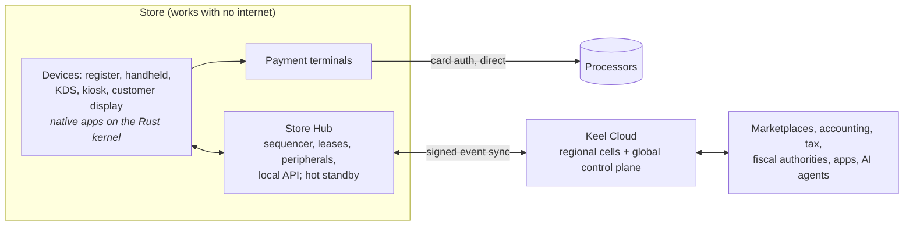

# Keel — the point-of-sale platform that never stops selling

> *Keel* is a working codename. A keel is the backbone that keeps a ship upright in any weather.

Keel is a design for **the best POS system in the world**. It combines the strongest ideas from
today's POS products and removes the failures that make merchants feel trapped, stranded or
offline.

**Status: building the foundations.** The research, architecture, decision records, feature
catalog and roadmap are in a v1 draft. Six kernel crates are built and tested, the last two in
part:
[`keel-types`](./core/crates/keel-types/) (money, currencies, rounding, quantities, time,
identifiers, business dates), [`keel-events`](./core/crates/keel-events/) (the signed,
hash-chained event log), [`keel-domain`](./core/crates/keel-domain/) (event schemas and the first
business aggregates: orders, their lines and their split among checks, payments in cash and by
card, and closing checks and orders) and [`keel-pricing`](./core/crates/keel-pricing/) v0, which
prices each check: line amounts, shares of split lines, discounts, US sales tax, rounding and the
calculation trace. [`keel-store`](./core/crates/keel-store/) keeps events on the device in SQLite,
encrypted with SQLCipher: the event log, with the device's own events and those it receives from
other replicas, projections of orders and payments, and an outbox of effects, all written in
crash-tested transactions, with checks that find damage and fail closed.
[`keel-sync`](./core/crates/keel-sync/) replicates events between stores, over any network.
[`keel-sim`](./core/crates/keel-sim/) tests it: devices, a hub and the cloud, with real stores,
through lost and reordered messages, partitions, crashes, restored backups and clock jumps,
each run replayable from its seed.
[docs/progress.md](./docs/progress.md) tracks the build step by step.

## What makes Keel different

| Industry problem (from research) | Keel |
|---|---|
| "Offline mode" keeps card payments but stops login, loyalty, gift cards, kitchen sync and close-out. Cloud or DNS outages stop thousands of stores. | **Local-first**: every in-store function runs without the internet or Keel Cloud. A Store Hub (any device or a small appliance) sequences the store's events, with hot-standby failover and island mode. |
| Mandatory processing, penalty fees, locked hardware, multi-year contracts, surprise fees | **Processor-agnostic** (≥ 3 connectors at GA), commodity hardware, month-to-month terms, a $0 early-termination fee, no guest fees ever, 90-day price-change notice |
| Merchants stranded by acquisitions, forced migrations and sunsets | **Sunset guarantee**, ≥ 24-month API support, ≥ 5-year hardware support, one-click full export |
| Tablet hell, menu drift, kitchens flooded by digital orders | **One catalog, one kitchen queue**, capacity-aware pacing across all channels, global 86 in ≤ 10 s |
| Shallow SMB tools or enterprise suites that need integrators | Enterprise-grade primitives (promotions, inventory, cash office, custody jobs) with SMB-grade UX and explainable pricing |
| Compliance handled ad hoc; fiscal rules that change and reverse | **Compliance as signed rule packs** + pluggable fiscal adapters + Keel's own tamper-evident journal |
| AI hype, and voice bots secretly staffed by humans | Verifiable answers, approval-gated actions with undo, a per-capability autonomy dial, honest automation metrics |
| Guest-hostile defaults (tip screens, QR-only menus, receipt spam) | Ethical defaults: tips off at counters, QR optional, receipts ≠ marketing consent |

## Architecture at a glance



- **One Rust kernel everywhere**: pricing, tax, promotions, domain state, sync, fiscal and payments
  orchestration. Totals are identical on every device and in the cloud.
- **An event-sourced, signed, hash-chained history**: tamper-evident by construction, fiscal-ready,
  replayable.
- **Native shells**: Android first (Kotlin/Compose), then iPad and iPhone (SwiftUI). React for web
  surfaces.
- **A cell-based cloud**: Postgres, NATS JetStream, ClickHouse; paired-region standby per residency
  zone.
- **Open platform**: REST API with parity, webhooks and event log, a Store Hub local API, offline WASM
  Functions, UI extensions, and an MCP server.

## Documentation map

| Start here | |
|---|---|
| [docs/vision.md](./docs/vision.md) | Vision, the 12 Keel promises, principles, non-goals, business model, success metrics |
| [docs/research/README.md](./docs/research/README.md) | Research synthesis: flaw → fix matrix, best-in-class features combined, incident lessons |
| [docs/product/feature-catalog.md](./docs/product/feature-catalog.md) | The complete feature list (~300 features across 24 domains) with tiers and rationale |
| [docs/architecture/README.md](./docs/architecture/README.md) | Architecture overview: quality attributes, topology, containers, kernel, flows, tech stack, repo layout, risks |
| [docs/roadmap.md](./docs/roadmap.md) | Phases (Foundations → MVP → v1 → v2 → v3), exit criteria, first engineering milestones, decision gates |

| Architecture deep-dives | |
|---|---|
| [domain-model.md](./docs/architecture/domain-model.md) | The universal Order, checks, payments, pricing pipeline, inventory, customers and value, bookings, custody jobs, workforce, cash, ledger, events |
| [offline-and-sync.md](./docs/architecture/offline-and-sync.md) | Local-first operation, hub sequencing, ownership, island mode, consistency classes, degraded-mode matrix, simulation testing |
| [payments.md](./docs/architecture/payments.md) | Connector SPI, tenders, offline risk envelope, surcharging, reconciliation, Keel Payments |
| [compliance.md](./docs/architecture/compliance.md) | Rule packs, tax engine, fiscalization (25 markets), labor, accessibility, privacy |
| [hardware.md](./docs/architecture/hardware.md) | Devices, hub appliance, Peripheral Service, KeelDoc printing, fleet management |
| [platform-and-extensibility.md](./docs/architecture/platform-and-extensibility.md) | APIs, events, local API, Functions, UI extensions, marketplace, MCP, agentic commerce |
| [security.md](./docs/architecture/security.md) | Threat model, device identity, PCI scope, tenant isolation, supply chain |
| [ai.md](./docs/architecture/ai.md) | AI architecture, capability portfolio, trust and safety |
| [docs/adr/](./docs/adr/README.md) | 11 Architecture Decision Records |

| Research dossiers (evidence base, with sources) | |
|---|---|
| [01 Restaurant POS](./docs/research/01-restaurant-pos.md) · [02 Retail POS](./docs/research/02-retail-pos.md) · [03 Payments & compliance](./docs/research/03-payments-compliance.md) · [04 Technical architecture](./docs/research/04-technical-architecture.md) · [05 Trends, AI & pain points](./docs/research/05-trends-ai-painpoints.md) · [06 Verticals & global](./docs/research/06-verticals-global.md) | |

> **Research caveat:** the research environment limited page fetching and web searches, so each
> dossier tags unverified claims and ends with a verification backlog. Architecture decisions rely
> only on well-corroborated patterns. Prices, dates and regulatory deadlines must be re-verified
> before commercial or legal use.

## Building

The kernel is a Rust workspace; `rust-toolchain.toml` pins the toolchain, and rustup installs it on
first use.

```sh
cargo fmt --all --check
cargo clippy --workspace --all-targets --all-features -- -D warnings
cargo test --workspace --all-features                      # add `-- --include-ignored` for the exhaustive sweeps
cargo build -p keel-types -p keel-events -p keel-domain -p keel-pricing --no-default-features --target wasm32-unknown-unknown
```

Read [docs/engineering/conventions.md](./docs/engineering/conventions.md) before changing kernel code.

## Next step

Phase 0 (Foundations) in the [roadmap](./docs/roadmap.md#8-first-engineering-milestones-the-next-build-steps):
after `keel-types`, `keel-events`, the order/pricing core and the SQLite store, the
deterministic sync simulator and the sync engine: replication, the simulator, hub sequencing
and ownership leases are built and reviewed, and hub election and failover is being designed.
