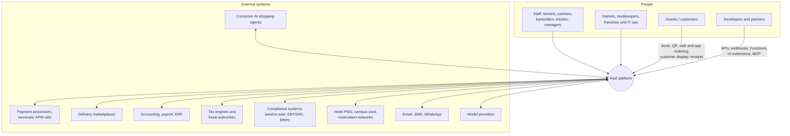
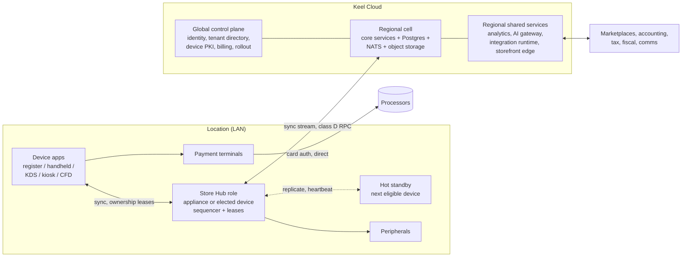
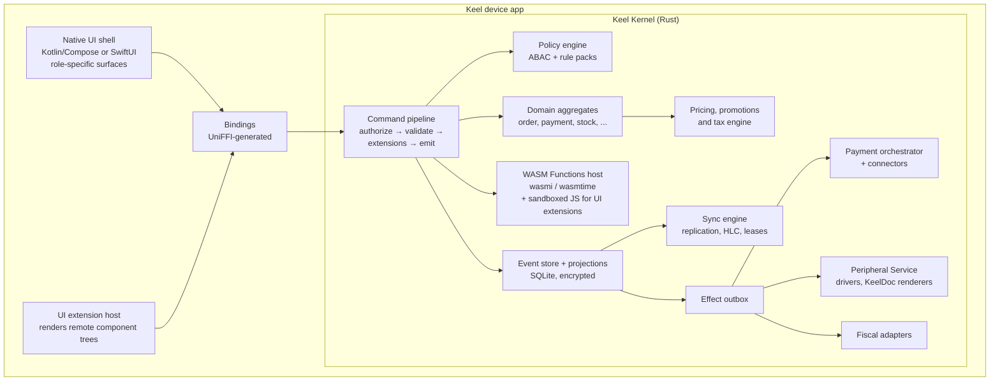
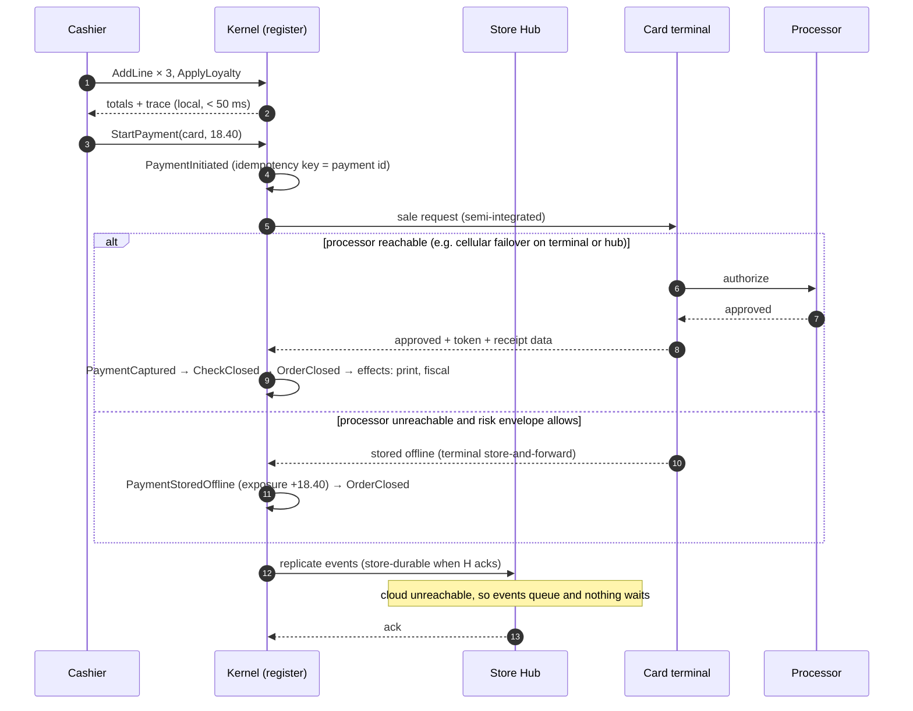
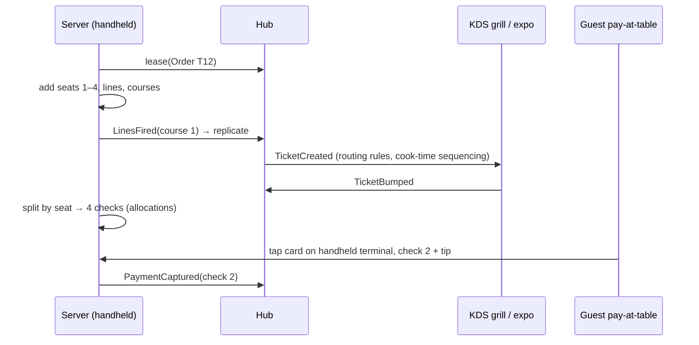
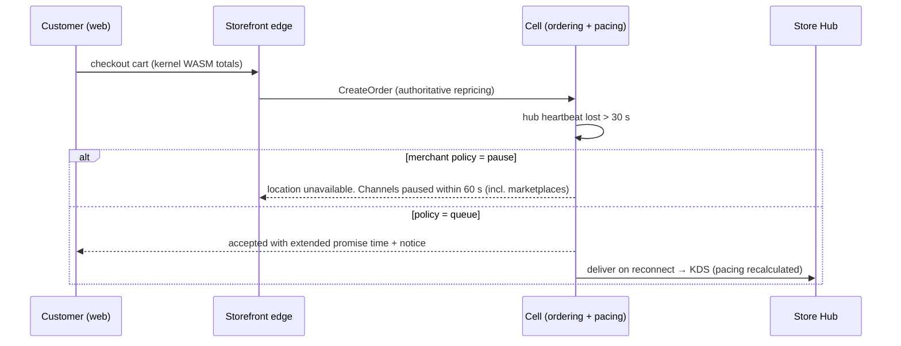
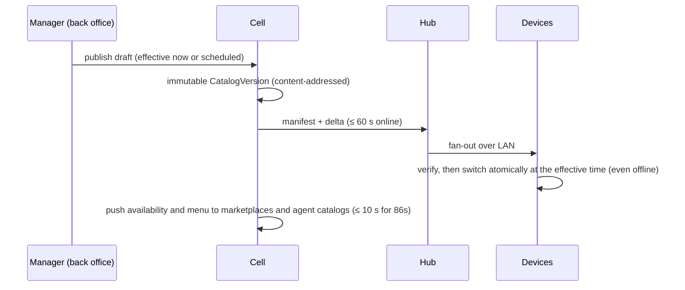

# Keel — Architecture Overview

> Status: **Draft v1** · Owner: Architecture · Last updated: 2026-09-27
>
> Start here. This document describes the whole system at medium depth and links to the deep-dives:
>
> | Deep-dive | What it covers |
> |---|---|
> | [domain-model.md](./domain-model.md) | Business primitives, events, money and pricing math |
> | [offline-and-sync.md](./offline-and-sync.md) | Local-first operation, replication protocol, failure modes |
> | [payments.md](./payments.md) | Processor-agnostic payments, terminals, offline risk, reconciliation |
> | [compliance.md](./compliance.md) | Tax engine, fiscalization, rule packs, labor, accessibility, privacy |
> | [hardware.md](./hardware.md) | Devices, Store Hub appliance, peripherals, printing, fleet |
> | [platform-and-extensibility.md](./platform-and-extensibility.md) | APIs, events, local API, WASM Functions, UI extensions, marketplace, MCP |
> | [security.md](./security.md) | Threat model, identity, PCI scope, tenant isolation, supply chain |
> | [ai.md](./ai.md) | AI architecture, capability portfolio, trust and safety |
> | [../adr/](../adr/) | Architecture Decision Records |

---

## 1. Quality attributes, ranked

When two qualities conflict, the higher one wins.

| Rank | Attribute | Scenario that defines it |
|---|---|---|
| 1 | **Availability at the point of sale** | Internet, Keel Cloud, processor, hub or any single device fails during Friday dinner rush. Staff keep ringing, firing, taking payment and closing checks (see the degraded-mode matrix). |
| 2 | **Correctness of money** | Across 20 devices, a 6-hour partition, crashes mid-payment and mixed software versions: no double charge, no lost sale, the ledger balances, totals match to the minor unit. |
| 3 | **Latency** | Every staff interaction < 50 ms p99 locally. Order to KDS < 250 ms p99. |
| 4 | **Security and compliance** | Keel never touches card numbers. Records are tamper-evident. Tenant isolation is provable. Country rules are applied without code releases. |
| 5 | **Openness** | A merchant switches processors, hardware or leaves Keel entirely without losing data or paying penalties. Any capability in the UI is available via API. |
| 6 | **Scalability** | One food truck to 100k locations. Stadium bursts of 50k transactions in 3 hours. 500k-SKU catalogs on a register. |
| 7 | **Evolvability** | Mixed-version fleets, schema evolution without rewriting history, rules shipped as data, verticals composed without forks. |
| 8 | **Cost efficiency** | Unit economics that make transparent, lock-in-free pricing sustainable. |

## 2. System context



## 3. Topology: device, Store Hub, cloud

The defining decision ([ADR-0001](../adr/0001-local-first-three-tier-topology.md)): **the store is
primary for in-store operations, and the cloud is primary for history, cross-store state and back
office.**



Full detail: [offline-and-sync.md](./offline-and-sync.md).

## 4. Containers

### 4.1 Device runtime (every register, handheld, KDS, kiosk, customer display)



- The **UI is thin**. It renders projections and sends commands. All business logic lives in the
  kernel, so every platform behaves identically and the UI can be rewritten without risk to money.
- **Native shells** ([ADR-0004](../adr/0004-client-ui-stack.md)):
  - Kotlin/Compose on Android, the first platform. It covers all-in-ones and Android payment
    terminals, and runs the hub role as a foreground service.
  - SwiftUI on iPad and iPhone.
  - Compose Multiplatform desktop for Windows/Linux lanes (v3).
- **One app, many roles.** Register, handheld, KDS, kiosk, customer display and hub are modes of one
  app build per platform, switched by administrators.
- **Browsers are clients, never hubs.** Hub-served web surfaces (order boards, secondary displays)
  connect to the Store Hub over its trusted local hostname.

### 4.2 Store Hub runtime
The hub runs the same kernel plus:
- **hub services**: leases, number blocks, escrow tables, relay and fan-out, the stored-value
  snapshot, health scoring;
- **the local API** (REST + WebSocket);
- **the Peripheral Service** for shared and network peripherals;
- **network diagnostics**;
- **the cloud gateway** (sync stream, class D RPC proxy, cellular failover);
- **local backups**.

It runs in one of these ways:
- on the Keel Hub appliance (image-based Linux, A/B updates);
- inside the app on an eligible device (an Android foreground service, a Windows/macOS/Linux service,
  or an iPad in foreground mode);
- as a container on a chain's existing edge cluster.

It **sequences** the store's events, grants **ownership leases**, and keeps a **hot standby** on the
next eligible device ([offline-and-sync §4, §5, §7](./offline-and-sync.md)).

### 4.3 Keel Cloud

**Global control plane.** Small, boring and highly available. Cells keep running if it's down.
- Identity: users, OAuth/OIDC, passkeys, SSO, SCIM.
- Tenant directory and **cell router**.
- Device registry and **Device CA** (enrollment, attestation verification, certificates, revocation).
- Keel's own billing, the app marketplace, and the developer platform.
- **Release and rollout service**: rings, update windows, feature flags, kill switches, rule-pack
  distribution.

**Regional cells** (data plane). Each cell is a complete, independent stack serving a subset of tenants
([ADR-0007](../adr/0007-cell-based-cloud-modular-monolith.md)):
- **Keel Core service**: a Rust **modular monolith** that links the same kernel crates. Its modules
  are catalog, ordering, payments, fulfillment, inventory, customers and value (stored value, loyalty,
  memberships), bookings and custody jobs, workforce, cash, fiscal, ledger, reporting API, **sync
  ingest**, notifications and automations.
- **Workers** for async jobs: recurring billing, exports, reconciliations, report materialization.
- **PostgreSQL** (HA, multi-AZ) for projections, the recent event store (hot window), the outbox and
  the ledger. Row-level security for tenant isolation.
- **NATS JetStream** for internal events, work queues and fan-out to integrations.
- **Object storage** for the event archive (Parquet/Iceberg), receipts, media, exports and fiscal
  archives (object-locked where law requires WORM).
- **Valkey** for caches, rate limits and presence.
- **Warm standby in a paired region** within the same residency zone: RPO ≤ 1 min, RTO ≤ 15 min,
  quarterly failover drills.

**Regional shared services**:
- **Analytics**: CDC → ClickHouse → semantic layer.
- **AI gateway** and model routing.
- **Integration runtime**: a TypeScript connector workers framework for marketplaces, accounting,
  payroll, e-commerce, tax, fiscal, PMS and compliance systems.
- **Storefront edge**: first-party online ordering, QR ordering and pay pages served from CDN/edge.
- **Search** for back-office and customer lookup.

### 4.4 Web surfaces
- **Back office**: a React single-page app on the public API. It's installable as a PWA, and the
  mobile manager app shares components.
- **Storefront**: first-party ordering, QR order and pay, gift card and membership purchase, booking
  pages. It computes carts with the kernel compiled to WASM for instant totals; the cloud recomputes
  authoritatively.
- **Developer portal**: docs, API explorer, sandbox provisioning, app submissions.

## 5. The kernel

The kernel ([ADR-0003](../adr/0003-rust-kernel-everywhere.md)) is the heart of Keel: one Rust
workspace, compiled for iOS, Android, Windows, macOS, Linux, the browser (WASM) and the cloud.

| Crate (planned) | Responsibility |
|---|---|
| `keel-types` | Money and ISO 4217 currencies, rounding, Rate, Decimal, Quantity and units, Timestamp and clocks, HLC, typed IDs (UUIDv7), BusinessDate, and Locale (v0 built: amounts and quantities as `en-US` and `es-US` show them, from CLDR 48: [ADR-0023](../adr/0023-register-shell.md)) |
| `keel-events` | Event envelope, canonical CBOR, COSE signatures, hash chaining, log writing and chain verification, device registry and revocation |
| `keel-domain` | Event payload schemas and the schema registry; aggregates, their total fold functions and command checks: order (built so far: creation, attributes, lines, their split among checks, closing checks and orders, and its owning device under a lease, with the hub's answers to requests for it), payment (built so far: cash and card), and checkout across them; kitchen ticket, stock, drawer session, booking, custody job, stored value, loyalty, membership, time entry. Also the location profile (v0 built: a location's settings, pricing rules, catalog, menu and team, content-addressed, and ringing a variant with its modifiers: [ADR-0023](../adr/0023-register-shell.md)) |
| `keel-pricing` | Price resolution, promotions optimizer, tax engine, allocation, rounding, trace (v0 built: line amounts, shares of split lines, discounts and their allocation, US sales tax, rounding, trace) |
| `keel-policy` | ABAC permissions, approvals, rule-pack evaluation with explanations |
| `keel-store` | SQLite event store, projections, snapshots, outbox, retention (built so far: the event log, with the device's own and received events, the quarantine and the version vector; projections of orders and payments; the effect outbox; all in crash-tested transactions, encrypted at rest with SQLCipher, with integrity checks; the hub's sequencing records, and confirmation by hash; each order's owner, lease and waiting requests, and answering requests as the hub; the hub's claims and the chain of terms they make, which records count, and claiming the role. A platform crate, not built for `wasm32`: [ADR-0016](../adr/0016-device-store.md), [ADR-0017](../adr/0017-projections-and-outbox.md), [ADR-0018](../adr/0018-encryption-at-rest-and-integrity-checks.md), [ADR-0020](../adr/0020-hub-sequencing.md), [ADR-0021](../adr/0021-ownership-leases.md), [ADR-0022](../adr/0022-hub-election-and-failover.md)) |
| `keel-sync` | Replication protocol, version vectors, leases, escrow, hub election (built so far: replication v0, anti-entropy by version vector over any transport, sans I/O, for `keel-store` and any other replica; the hub's role, answering requests for orders and sequencing, store durability and the cloud's watermark; heartbeats and the hub's election by priority, failover, and islands. A platform crate: [ADR-0019](../adr/0019-replication-and-deterministic-simulation.md), [ADR-0020](../adr/0020-hub-sequencing.md), [ADR-0021](../adr/0021-ownership-leases.md), [ADR-0022](../adr/0022-hub-election-and-failover.md)) |
| `keel-pay` | Payment orchestrator, tender plugins, risk envelope, connector trait |
| `keel-fiscal` | Fiscal adapter trait and jurisdiction adapters |
| `keel-periph` | Peripheral Service and its drivers, raw TCP to printers first; KeelDoc's layout and renderers are `keel-doc`'s |
| `keel-ext` | WASM Functions host, fuel metering, hook contracts; sandboxed JS runtime (QuickJS-class) for UI extensions |
| `keel-sim` | Deterministic simulator: virtual network, clocks and disks; fault injection; invariant checkers (built so far: devices, the hub and the cloud with real stores in one thread and virtual time; lost, duplicated and reordered frames, partitions, crashes mid-write, rollbacks and clock jumps; a workload of real sales; the protocol's rules checked as runs go, and convergence, no loss, causality, forks and store checks after; the hub's numbering, confirmation, feeds, watermarks and store durability; requests for orders, overrides from devices that hear no hub, and the hubs' answers; the hub and its standby, splits of the store's network, failover, and one hub agreed on at the end. For tests only: [ADR-0019](../adr/0019-replication-and-deterministic-simulation.md), [ADR-0020](../adr/0020-hub-sequencing.md), [ADR-0021](../adr/0021-ownership-leases.md), [ADR-0022](../adr/0022-hub-election-and-failover.md)) |
| `keel-runtime` | The device runtime a shell drives: a cashier's intents as the kernel's commands, one write each, and views of the store with their display text; drivers for printers and the network beside it. A platform crate; its intents and views built ([ADR-0023](../adr/0023-register-shell.md), slice 1), its drivers to come |
| `keel-doc` | KeelDoc, the document model receipts are laid out in, and its renderers, ESC/POS first (planned: [ADR-0023](../adr/0023-register-shell.md), slice 2) |
| `keel-net` | The LAN transport: WebSocket over TLS 1.3 with mutual TLS, carrying `keel-sync`'s frames (planned: [ADR-0023](../adr/0023-register-shell.md), slice 5) |
| `keel-ffi` | UniFFI (Kotlin for Android and JVM desktop, Swift for Apple), C ABI, wasm-bindgen (web) bindings (Kotlin first: [ADR-0023](../adr/0023-register-shell.md), slice 3) |

**Command pipeline** (identical on device, hub and cloud):

```text
Command ─► authorize (ABAC, limits → maybe ApprovalRequired)
        ─► load aggregate(s) from projections/snapshots
        ─► validate invariants
        ─► run extension hooks (WASM, fuel-limited, deterministic)
        ─► decide events (pure function)
        ─► append events + update projections + enqueue effects   (one SQLite transaction)
        ─► notify UI subscriptions; sync engine ships events
```

## 6. Key flows

### 6.1 Counter sale with card, internet down



### 6.2 Table service: fire, split, pay at table



### 6.3 Online order during a store outage



### 6.4 Menu change published



## 7. Data architecture

| Data | System of record | Replicated to | Retention |
|---|---|---|---|
| Operational events (orders, payments, kitchen, drawers, time) | Origin device → hub → cloud (durable-ack watermark) | Every device in the location scope (rolling window), the hub (90 d), the cloud hot store (Postgres, ~90 d) and the archive (object storage, Iceberg) | Legal minimum per jurisdiction (often 6–10 years) for fiscal data; merchant-configurable otherwise |
| Projections (orders, stock levels, balances) | Derived. Rebuildable from events. | Local SQLite; cloud Postgres | As needed |
| Reference data (catalog, config, rule packs) | Cloud (authoring) | Devices (versioned snapshots and deltas) | Version history kept |
| Stored value, loyalty, memberships | Cloud (class D), with offline escrow | Hub compact snapshot | Ledger retention rules |
| PII | PII vault (cloud, per-person keys) | Minimal encrypted device cache | Policy-driven; crypto-shred on erasure |
| Analytics | ClickHouse (derived from CDC) | Merchant warehouses (Iceberg / Snowflake / BigQuery …) | Configurable |

**Event store tiering in the cloud**: recent events are in Postgres, partitioned by tenant hash and
month, for sync and fast replay. Older events move to Parquet/Iceberg in object storage and are
queried via ClickHouse or the lakehouse, and re-hydrated on demand. Initial sizing assumption: about
5k locations per cell at about 5k events per location per day, which is about 25M events per day per
cell, well within one Postgres primary with batching.

## 8. Deployment, release and operations

- **Infrastructure**: Kubernetes per cell. IaC with OpenTofu and GitOps with Argo CD. The design is
  cloud-portable (no proprietary databases in the critical path), starting on one cloud provider with
  a region pair per residency zone.
- **Release rings**: internal cell → canary cell → cells by risk tier. Devices: internal fleet →
  opt-in early-access merchants → 1% → 10% → 50% → 100%, **always inside each store's update window**.
  Automatic halt and rollback on health regressions (crash rate, payment success, sync lag, p99
  latency).
- **Everything is rolled out in rings**, not just code: config, feature flags, rule packs, tax tables,
  extension versions and connector changes.
- **Observability**:
  - OpenTelemetry everywhere, including devices, which batch telemetry through the sync channel with
    offline buffering.
  - Merchant health scores.
  - Synthetic transactions per cell and per connector.
  - SLOs per journey (sale completion at the edge, order-to-KDS, sync lag, webhook delivery).
- **Support tooling**:
  - With consent, **deterministic replay** of a device's event log in a sandbox to reproduce issues
    exactly (an event-sourcing superpower).
  - Remote diagnostics bundles, config diffs, and remote view with consent.

## 9. Verification strategy

| Layer | Method |
|---|---|
| Kernel domain logic | Unit tests plus **property-based tests**, e.g. allocations sum to totals, refunds ≤ paid, the ledger balances |
| Pricing and tax | **Golden baskets** (≥ 1,000) run on every platform build, which must produce identical output. Jurisdiction test vectors. Official fiscal test suites. |
| Sync and payments | **Deterministic simulation testing** with fault injection (see [offline-and-sync §12](./offline-and-sync.md#12-verification-deterministic-simulation-testing)) |
| Hardware | A hardware-in-the-loop lab (printers, terminals, scales, scanners) running nightly, plus device emulators in CI |
| Performance | Budgets enforced in CI on reference low-end devices (tap latency, cold start, 500k-SKU lookup) |
| End to end | Scripted service scenarios (dinner rush, Black Friday, stadium halftime, 6-hour outage) in staging cells |
| Security | Threat models per feature, SAST/DAST, dependency scanning, canary-tenant isolation tests, pentests, bug bounty |
| Accessibility | Automated checks plus manual audits with assistive-technology users |

## 10. Technology choices

| Layer | Choice | Rationale | ADR |
|---|---|---|---|
| Kernel | **Rust** | One implementation of money, tax, sync and crypto for every platform. Memory safety, performance on low-end devices, WASM target, embedded extension sandbox. | [0003](../adr/0003-rust-kernel-everywhere.md) |
| Device UI | **Kotlin + Jetpack Compose** (Android first, KMP-structured → Compose Multiplatform desktop for lanes); **Swift + SwiftUI** (iPad/iPhone); **React + TypeScript** for web surfaces | Native performance on low-end hardware; native payment, peripheral and MDM SDKs; hub role as an Android service; thin UI over the shared kernel | [0004](../adr/0004-client-ui-stack.md) |
| Local storage | **SQLite** (encrypted), FTS5 | Ubiquitous, robust, fast. One transaction spans events, projections and outbox. | [0002](../adr/0002-event-sourced-signed-event-log.md) |
| Sync | **Keel sync protocol** (own): hub-sequenced, signed event logs over WebSocket/TLS with mTLS | Enforces POS invariants (check ownership, no double payment, gapless fiscal numbering); islands keep selling; no vendor dependency in the most critical layer | [0006](../adr/0006-own-sync-protocol.md) |
| Cloud services | **Rust** (Axum, Tokio, sqlx) modular monolith per cell; **TypeScript** for the connector runtime and web | Shares kernel crates. Connectors favor ecosystem SDKs and velocity. | [0007](../adr/0007-cell-based-cloud-modular-monolith.md) |
| Database | **PostgreSQL** | Mature and portable, with RLS for isolation. Cells provide horizontal scale. | [0007](../adr/0007-cell-based-cloud-modular-monolith.md) |
| Messaging | **NATS JetStream** | Lightweight streams, KV and work queues. Simple operations per cell. | [0007](../adr/0007-cell-based-cloud-modular-monolith.md) |
| Analytics | **ClickHouse** + semantic layer; **Iceberg** archive | Real-time analytics at low cost. Open table format for merchant data sharing. | — |
| Extensions | **WebAssembly** (wasmi on iOS, wasmtime elsewhere) | Deterministic, sandboxed, portable, offline | [0008](../adr/0008-wasm-extensions-run-offline.md) |
| Payments | Processor-agnostic orchestrator; semi-integrated terminals | No lock-in, minimal PCI scope, no cloud hop on card auth | [0005](../adr/0005-processor-agnostic-payments.md) |
| Compliance | Pluggable fiscal adapters + signed rule packs | Ship law as data. Certify per country. | [0009](../adr/0009-compliance-as-data-and-fiscal-adapters.md) |
| Hardware | Peripheral Service + KeelDoc | Any printer and any script. Hub-attached peripherals serve iOS and web. | [0010](../adr/0010-hardware-abstraction-and-document-model.md) |
| Privacy | PII vault + crypto-shredding | Immutable history and the right to erasure can coexist | [0011](../adr/0011-pii-vault-and-crypto-shredding.md) |
| AI | Model gateway, semantic layer, tool layer = public API/MCP; Claude-family models for language tasks | Grounded, permissioned, auditable | [ai.md](./ai.md) |
| Infra | Kubernetes, OpenTofu, Argo CD, OpenTelemetry | Standard, portable | — |

## 11. Repository layout (monorepo)

```text
/Cargo.toml            Rust workspace root: one lockfile for every Rust component
/core/crates/          Kernel crates, keel-* (see §5); keel-types, keel-events, keel-domain,
                       keel-pricing, keel-store, keel-sync and keel-sim are built, in part
/hub/                  Store Hub daemon and appliance image definitions
/cloud/                Cloud services (Rust): core modular monolith, workers, sync ingest, gateway
/connectors/           Integration runtime and connectors (TypeScript)
/apps/android/         Android app (Kotlin, Jetpack Compose, KMP modules): register, handheld, KDS,
                       kiosk, CFD and hub modes; desktop target for Windows/Linux lanes (v3)
/apps/apple/           iPadOS / iOS app (Swift, SwiftUI)
/apps/web/backoffice/  Back office web app (React + TypeScript)
/apps/web/storefront/  Online ordering, QR order and pay, booking and gift card pages
/apps/web/displays/    Hub-served display surfaces (order boards, menu boards, secondary displays)
/design/               Design tokens and the cross-platform component specification
/packages/sdk-ts/      TypeScript API client (generated)
/schemas/              Source of truth: event schemas, API (OpenAPI), rule-pack schemas
/infra/                OpenTofu, Kubernetes manifests, cell templates
/tools/                keel CLI, codegen, simulators, hardware emulators
/docs/                 Vision, research, architecture, ADRs, product
```

## 12. Top risks and mitigations

| Risk | Impact | Mitigation |
|---|---|---|
| Sync or merge bugs corrupt money or lose sales | Critical | Deterministic simulation testing from day one; total fold functions; no discarded events; staged rollouts; replay tooling |
| Scope explosion (all verticals, all countries) | High | A strict tiered roadmap ([roadmap.md](../roadmap.md)); verticals are configurations of 15 primitives; say no to forks |
| Payment connector breadth takes years | High | Start with semi-integrated terminal platforms that aggregate many processors. Build the connector SDK early. Partner-built connectors. |
| Fiscal certification per country is slow and costly | High | Adapter architecture from day one. Enter fiscalized markets in deliberate order. Partner with certified fiscal cloud providers where allowed. |
| Two native UI codebases drift apart | Medium | A thin UI over the kernel; generated screen contracts; a shared component spec; cross-platform scenario tests; Android-first sequencing; "done = shipped on every platform in tier" |
| Rust talent and FFI complexity | Medium | A narrow, generated FFI surface (UniFFI). A separate kernel team. Product engineers write Kotlin, Swift or TypeScript against typed bindings. |
| iOS background limits constrain the hub role on iPads | Medium | Recommend the hub appliance for multi-device iPad sites. Foreground-hub mode with a hot standby on another device. Island mode keeps every device selling. |
| Offline payment losses hurt merchants | Medium | Conservative defaults, BIN rules, exposure meter, decline recovery, clear merchant consent |
| Incumbents copy the features | Medium | Architecture (true local-first, kernel everywhere) and business-model honesty are hard to copy without dismantling their revenue model |
| AI features underdeliver or misbehave | Medium | Evaluation gates, approval-gated actions, autonomy dial, honest metrics, kill switches |

## 13. Open questions (to resolve in upcoming ADRs)

1. **Initial payment platform(s)**: which semi-integrated terminal ecosystems to certify first (see
   [payments.md](./payments.md) §8 for the shortlist and criteria).
2. **Identity provider**: self-hosted OIDC (Ory/Zitadel-class) vs a managed provider for the control
   plane.
3. **Hub appliance**: build a reference design with an ODM, or certify off-the-shelf mini-PCs plus
   LTE routers first.
4. **Launch market sequence** after the US: Canada and the UK (no fiscalization) vs an early EU
   fiscal market (Germany/France) to prove the compliance architecture.
5. **Keel Payments**: which PayFac-as-a-service partner, and when (v2 target).
