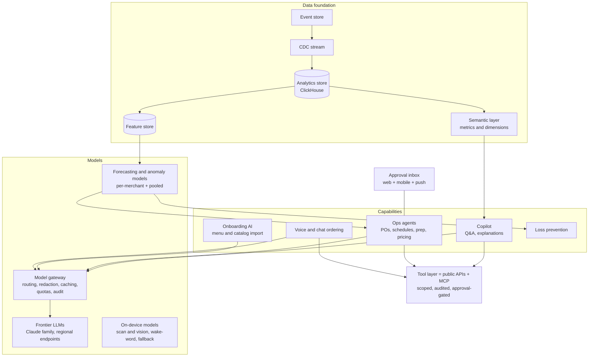

# Keel — AI Architecture

> Status: **Draft v1** · Owner: Architecture & AI · Last updated: 2026-09-27

## 1. Stance

Most POS "AI" today is a chat box over reports. Keel's AI should **do work that operators hate
doing**:
- set up the catalog;
- count what to order;
- build next week's schedule;
- find the money leaking out of the business;
- explain why numbers moved;
- and take orders when nobody can pick up the phone.

It should do all this with the operator firmly in control.

**Principles**
1. **Grounded, not guessed.** Answers about a merchant's business come from the semantic layer and
   carry citations to the underlying report or records. If the data can't answer the question, say so.
2. **AI proposes, humans dispose.**
   - Consequential actions (sending a PO, publishing a schedule, changing prices, messaging
     customers) are drafted for approval, unless the merchant has explicitly delegated a bounded
     policy (e.g. "auto-reorder cups when below 2 days of cover, max $300").
   - Every AI action is attributed, audited and reversible where possible.
3. **The same permissions as people.** AI features act through the same APIs, scopes and ABAC limits
   as staff and apps. There's no god-mode service account.
4. **Private by default.**
   - Merchant data is never used to train shared models without opt-in.
   - PII is minimized or redacted before model calls.
   - Processing stays in the tenant's region.
5. **Measured.** Every AI feature ships with offline evaluations, online success metrics and a kill
   switch. Features that don't beat the manual baseline don't ship.
6. **Useful offline where it matters.** Anything in the sales path (recommendations, fraud prompts,
   voice commands) has a deterministic fallback when models are unreachable. The store never waits on
   a model.
7. **No LLM in the money path.** Language models never compute prices, taxes, totals, fiscal
   documents or payment decisions. Those are the kernel's deterministic job. AI proposes changes to
   configuration (for example a price-list draft), and the kernel executes it after approval.

## 2. Reference architecture

- **Semantic layer.** One set of metric definitions (net sales, comps, labor %, prime cost, sell-through,
  shrink, and so on) serves reports, APIs, exports and the copilot. The copilot never hand-writes SQL
  against raw tables. It composes semantic queries, which makes answers consistent with the reports
  the merchant already trusts.
- **Model gateway.** Routes each task to the most suitable model tier:
  - fast, cheap models for extraction and classification;
  - the most capable models for multi-step reasoning and agent planning.

  It also redacts PII, enforces per-tenant quotas and budgets, caches, logs prompts and outputs for
  audit (retention-limited), and pins model versions per feature for reproducible evaluations.
- **Tool layer.** Agents use the same REST API and MCP tools as external developers, under a
  delegated, scoped identity. Write tools return *drafts* that land in the **approval inbox** unless a
  delegation policy covers them.
- **Classic ML stays classic.** Forecasting (sales, items, covers, labor demand) and anomaly detection
  use purpose-built time-series and statistical models trained per merchant, with pooling across
  similar merchants on an opt-in basis for cold start. LLMs are the interface and planner, not the
  forecaster.

## 3. Capability portfolio (prioritized)

Ranking is value × feasibility × trust. The tier is the product tier in the
[feature catalog](../product/feature-catalog.md).

| # | Capability | What it does | Tier |
|---|---|---|---|
| 1 | **Instant onboarding import** | Builds a structured catalog from a photo or PDF of a menu, a website, a spreadsheet or a competitor's export: items, modifiers, prices, categories, allergens, tax categories. The merchant reviews a diff before publishing. | MVP |
| 2 | **Contextual staff help** | "How do I split this check by seat?" answered in the staff member's language, grounded in docs and the device's current screen state | v1 |
| 3 | **Business Q&A copilot** | "Why were sales down Tuesday?" gives a decomposition (traffic vs ticket, dayparts, items, weather, staffing) with citations and suggested actions | v1 |
| 4 | **Demand forecasting** | Item, daypart and location forecasts with weather, holidays and local events. Feeds prep, ordering and scheduling. | v1 |
| 5 | **Smart ordering agent** | Draft purchase orders from forecasts, par levels, lead times, pack sizes and vendor minimums. Approve in one tap. | v2 |
| 6 | **Schedule builder agent** | Draft schedules from forecast labor demand, availability, skills, budgets and **labor-law constraints** (breaks, predictive scheduling, minors) | v2 |
| 7 | **Loss-prevention sentinel** | Flags void, refund, discount and no-sale anomalies, sweethearting patterns and cash variances, with evidence packets (event trail plus optional video timestamps) | v2 |
| 8 | **Menu and assortment engineering** | Profitability × popularity analysis, recipe cost drift alerts when supplier prices change, suggested price or placement tests. **Guardrails**: no covert surge pricing; changes need approval and are logged. | v2 |
| 9 | **Invoice capture** | Photo or email of supplier invoices → line items matched to catalog and PO → cost updates and three-way match | v2 |
| 10 | **Phone and chat ordering** | Answers calls, takes orders against the live menu and availability, confirms totals, and pushes to the order pipeline. Transfers to a human on low confidence or on request. | v2 |
| 11 | **Voice ordering for drive-thru and kiosk** | Same engine as #10, low-latency streaming, visible order confirmation board, crew override | v3 |
| 12 | **Marketing assistant** | Segments, campaign drafts, offer suggestions with predicted lift, and a holdout-based measurement after send | v2 |
| 13 | **Dynamic quote times** | Pickup and delivery ETAs from live kitchen load (a deterministic model, with ML refinement) | v1 |
| 14 | **Reconciliation assistant** | Explains deposit mismatches, fee anomalies vs contracted pricing, and cash over/short patterns | v2 |
| 15 | **Agentic commerce readiness** | Clean machine-readable catalog, availability and checkout for consumer AI agents (see the platform doc §11) | v3 |

## 4. Trust and safety design

- **Prompt-injection containment.** Customer names, order notes, reviews, emails, supplier invoices and
  web pages are **untrusted content**.
  - They are passed to models as quoted data with provenance tags, never as instructions.
  - Tool calls triggered while processing untrusted content need a human approval, regardless of
    delegation policy.
- **Bounded delegation.** Delegation policies are explicit objects: scope, limits, schedule and
  expiry, e.g. "Auto-approve POs to Sysco under $500 for paper goods." They are visible, editable,
  revocable, and every autonomous action is reported in a daily digest.
- **Explainability.** Every recommendation carries its "because": the drivers and data behind it,
  with links. Every forecast shows its expected error range.
- **Fairness and consumer protection.**
  - No individualized pricing based on personal data.
  - Promotional personalization respects consent.
  - Voice ordering discloses that it's automated and offers a human.
- **Evaluation harness.** Each capability has a curated evaluation set (e.g. 500 real, anonymized
  menus for import accuracy, and historical weeks for forecast accuracy) run on every model or prompt
  change. Online metrics include acceptance rate of drafts, edit distance, forecast error and time
  saved.

## 5. On-device and offline

- **On device**:
  - barcode and document scanning (platform vision APIs);
  - produce recognition on scale-equipped lanes (optional module);
  - wake-word or command recognition for hands-free KDS ("bump 42").
- Platform on-device models (Apple Foundation Models, Gemini Nano) are used where present. They're
  generally absent on the Google-services-free, low-end Android all-in-ones common in POS.
- **The practical offline path is a small model hosted on the hub appliance** (llama.cpp- or
  ONNX-class), for staff help and voice commands during outages.
- **Offline fallbacks**:
  - forecasts and recommendations are **precomputed** and synced as reference data (e.g. prep lists,
    suggested pars);
  - loss-prevention rules run as deterministic kernel checks;
  - voice ordering falls back to a human.

## 6. Cost and latency

- **Latency budgets**:
  - voice turns < 800 ms to first audio;
  - copilot answers stream within 1.5 s;
  - agents run asynchronously.
- **Cost controls**: per-tenant budgets, caching of semantic query results, batch inference for
  nightly jobs (forecasts, digests), and a model tier matched to the task.
