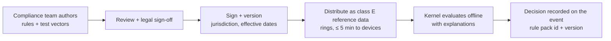

# Keel — Compliance Architecture

> Status: **Draft v1** · Owner: Compliance & Architecture · Last updated: 2026-09-27
>
> Decision record: [ADR-0009](../adr/0009-compliance-as-data-and-fiscal-adapters.md) · Evidence:
> [R03](../research/03-payments-compliance.md), [R06](../research/06-verticals-global.md)
>
> ⚠️ Regulatory dates below reflect research as of 2026-09-27, with many items flagged for
> verification. Counsel and tax advisers must confirm primary sources before any market launch.

## 1. Principles

1. **Compliance is data, not code.** Rules that change with law ship as **signed rule packs**,
   independent of app releases. Protocols, cryptography and document formats are code in **country
   adapters**.
2. **Rules reverse, not just change.** France removed and then restored self-attestation for cash
   software. Spain postponed VeriFactu twice. The UAE extended its service-provider deadline. Croatia
   switched hash algorithms. Everything is **effective-dated and rollback-able**.
3. **One immutable journal, independent of any provider.** Keel's own signed, hash-chained event log
   is the evidence base. Fiscal providers can be swapped without breaking audit continuity.
4. **Contingency everywhere.** Every regime that needs the network has a legal offline procedure, and
   Keel implements each one as a state machine with legal deadlines as parameters.
5. **Release trains per country.** Certified versions are pinned where certification ties to software
   versions.
6. **Buy vs build.** Keel builds the orchestrator, event model, journal and rule engine. It partners
   for long-tail and hardware-heavy markets (cloud TSEs, clearance intermediaries, Peppol access
   points, accredited service providers). It builds in-house only in strategic markets.

## 2. Rule packs



- **Scope**:
  - tax rates, taxability and rounding;
  - surcharge, dual-pricing and all-in-price rules;
  - tender eligibility (SNAP/WIC/FSA/meal vouchers);
  - age thresholds and sale-time windows;
  - purchase limits with equivalency;
  - cash rounding and cash-acceptance obligations;
  - tip-credit and card-fee-deduction permissions;
  - break, overtime, minor-labor and predictive-scheduling rules;
  - required disclosures and legends;
  - fiscal document requirements and deadlines;
  - auto-renewal and cancellation rules.
- **Format**:
  - A declarative rule language: typed conditions over order, line, customer, location, time and
    tender context, with actions to allow, deny, require (a prompt, approval or verification),
    compute (an amount or rate), or disclose (a text or template).
  - Rules are compiled to a compact form the kernel evaluates in microseconds.
  - Escape hatches for rare cases are **reviewed WASM Functions** signed by Keel.
- **Explanations** are mandatory. Every decision records the rule pack and version, and produces a
  human-readable reason ("Surcharge not allowed: debit card (BIN 4xxxxx) — Visa rule").
- **Testing**: each pack ships with golden test vectors (baskets, customers, times) run in CI and on
  device builds.
- **Operations**:
  - Staged rollout like code.
  - A scheduled change activates at local midnight on its effective date, even offline.
  - Emergency rollback.
  - Target: a regulatory change such as a SNAP waiver date or a deadline shift is deployed as data
    **within an hour** of sign-off.

## 3. Tax engine

Part of the kernel pricing pipeline ([domain model §8](./domain-model.md#8-pricing-and-tax-calculation)).

| Capability | Notes |
|---|---|
| Inclusive and exclusive pricing | Including mixed baskets for cross-border chains |
| Multiple and stacked taxes | GST+PST/QST, excise (e.g. cannabis), levies |
| Taxability by category and context | **Eat-in vs takeaway**, prepared food (SSUTA definitions in the US), clothing thresholds, candy and soft drinks, services, delivery fees, service charges |
| Bundles | Apportionment of bundle prices across tax rates (e.g. Germany: 7% food + 19% drinks in one menu) |
| Vouchers | EU single-purpose (taxed at issue) vs multi-purpose (taxed at redemption) |
| Exemptions | Customer certificates with jurisdiction and expiry; customer classes (e.g. senior and PWD rules where applicable); **no sales tax on the SNAP-funded portion** |
| Holidays and temporary changes | Date- and threshold-bound (e.g. US tax holidays, Canada's 2024–25 GST/HST holiday) |
| **Rounding granularity** | Per jurisdiction and effective-dated: per line, per document, or **once per rate per invoice** (Japan). The method is recorded on each document. |
| Destination-based tax | Delivery and shipping use cached rate tables with an online engine fallback |
| US engine connectors | Avalara, Vertex and TaxJar-class. **Offline rate cache per location**, commit and void mirroring, post-hoc reconciliation after offline periods |
| Legends | Fiscal-pack-driven receipt text (e.g. "IVA Contenido", Japanese registration number, per-rate totals) |

**Effective-dated rate changes seen in 2025–2026**, which show why this matters:
- India's GST rationalization, 22 September 2025;
- Germany's restaurant food rate cut to 7% from 1 January 2026 (drinks stay at 19%);
- Brazil's CBS/IBS test rates, 2026.

**Golden baskets** include Japan 8%/10%, Germany food plus drinks on one bill, India after the GST
change, and US prepared food.

## 4. Fiscalization and e-invoicing

### 4.1 Four integrity models

| Model | Countries (examples) | How Keel implements it |
|---|---|---|
| (a) Hardware secure element / fiscal device | DE (TSE), AT (signature unit), BE (FDM for restaurants), SE (control unit), IT (RT), HU, TR | **Fiscal device agent** in the Peripheral Service (USB, SD or cloud variants), with health telemetry and failover rules per law |
| (b) Software hash chain + signature | FR (ISCA/NF525), PT, ES (VeriFactu), NO, SA (ZATCA chain) | **Per-device chains in the kernel** (class B single-writer aggregates). Keys live in secure hardware where possible. |
| (c) Real-time clearance / authorization | HR (JIR), BR (NFC-e), MX (PAC/CFDI), AR (CAE), PL (KSeF), SA B2B, IT SDI | **Clearance connectors** through the effect outbox, with a contingency state machine |
| (d) Network / intermediary | UAE (ASP, Peppol 5-corner), BE and FR (Peppol / approved platforms) | **E-invoice gateway** connectors |

### 4.2 Fiscal orchestrator and provider SPI

```text
Kernel ──FiscalEvent (SaleCompleted, Void, Refund, Tip, Deposit, NoSale, Training,
                     ProvisionalBill, DayClose, DeviceChange, TaxRateChange …)──►
Fiscal Orchestrator (per location: jurisdiction resolver, policy, outbox, retries)
  ├─ Provider SPI: register() · sign(event) → FiscalProof · render(proof) → receipt blocks
  │                report(batch|event) · close(period) · export(format, range) · contingency(state)
  ├─ Device agent (edge): TSE, smart cards, FDM/SCU, control units, RT and fiscal printers
  ├─ Clearance and network connectors: KSeF, SDI, CIS/eRačun, SEFAZ, PAC, ARCA, IRP, ZATCA,
  │                Peppol AP, French approved platforms, UAE ASP, KRA eTIMS, ETA
  └─ Evidence: Keel's own signed, hash-chained journal (WORM archive, retention per country)
```

- **Checkout sequencing**: order finalized → fiscal `sign()` → receipt → payment capture, or payment
  first where the law allows it.
- **Latency SLA**: fiscal signing adds ≤ 800 ms at p95 with local devices and ≤ 2 s with cloud
  providers.
- **Contingency state machine** per provider: `ONLINE → DEGRADED → OFFLINE → CATCH_UP`. It engages
  within 3 s of provider failure. Legal catch-up windows are parameters (e.g. 24 h for Saudi B2C
  reporting, Croatian resubmission, Brazilian contingency NFC-e, documented German TSE failures). The
  backlog is visible to managers.
- **Numbering series**: legal numbering (per device or per series, e.g. Portuguese ATCUD series,
  Chilean CAF folio ranges) is allocated to devices in advance, so issuing works offline.
- **A sale is final** only when the fiscal step succeeds *or* a legal contingency record exists.
- **Payment–fiscal coupling**: payment method and authorization data flow into fiscal documents where
  required (e.g. certain Brazilian states; Italy and Greece link terminals to registers).
- **Invoices after the sale**: a receipt QR lets the customer convert it into a B2B e-invoice within
  the statutory window (Mexico autofactura, Malaysia MyInvois, Poland receipt-to-invoice). The link
  from receipt to invoice is preserved, and consolidated or global invoices exclude converted receipts.
- **Immutability**: finalized documents are never deleted. Corrections are linked reversals, and a
  delete via API is rejected.
- **Exports**: national audit formats (e.g. DSFinV-K, DEP, SAF-T variants) are generated from the
  journal.

### 4.3 Market snapshot and launch sequencing

Condensed from [R03 §5](../research/03-payments-compliance.md). Status as of 2026-09-27.

| Market | Regime (POS-relevant) | Key dates | Keel approach | Wave |
|---|---|---|---|---|
| US, Canada, UK, Australia | No POS fiscalization. Tax engine, surcharging and junk-fee rules. Québec restaurants use a sales recording module. | — | Tax engine plus rule packs. Québec module when entering that market. | 1 |
| Germany | TSE per transaction, DSFinV-K, POS registration with the tax authority (since 2025). B2B e-invoice issuance 2027/2028. | Live | Cloud-TSE partner + device agent for hardware TSEs | 2 |
| France | ISCA conditions (NF525 certificate or restored self-attestation), 6-year retention, e-invoicing and e-reporting reform | Sep 2026 (large companies) / Sep 2027 (SMEs) | Own hash chain + certification + approved-platform connector | 2 |
| Spain | VeriFactu (hash chain, QR, optional real-time submission); TicketBAI in Basque territories | 1 Jan 2027 (corporate) / 1 Jul 2027 (others) | Own chain + AEAT connector | 2 |
| Italy | RT or online procedure, daily totals, card terminals linked to RT from 2026 | Live | RT device agent / partner | 3 |
| Portugal | Certified software, ATCUD, QR, SAF-T. Qualified e-signature on PDF invoices. | QES from 1 Jan 2027 | Own chain + certification | 3 |
| Austria | RKSV signed receipts with chaining and an encrypted turnover counter; digital receipts | Live; 2026 package | Signature unit / cloud seal partner | 3 |
| Poland | Online cash registers; KSeF e-invoicing (FA(3)) | KSeF Feb/Apr 2026, micro 2027 | Partner + KSeF connector | 3 |
| Croatia, Greece, Hungary, Czech Republic, Belgium, Sweden, Norway | Real-time or device-based regimes (see R03) | Various 2026–2027 | Partner-first | 3 |
| Brazil | NFC-e as the only retail fiscal document; CBS/IBS reform | NFC-e only since 1 Jan 2026 | SEFAZ connector + contingency | 3 |
| Mexico | CFDI 4.0 via PAC; global CFDI; autofactura | Live | PAC partner | 3 |
| India | GST e-invoicing (B2B, IRN + QR); B2C dynamic QR for very large issuers | Live | IRP connector via GSP | 3 |
| Saudi Arabia | ZATCA Phase 2: B2B clearance, B2C reporting within 24 h, per-device hash chains and counters | Waves through 2026 | Own chain + ZATCA connector | 3 |
| UAE | Peppol 5-corner via accredited service providers | Go-live 1 Jan 2027 (large) / 1 Jul 2027 | ASP partner | 3 |
| Kenya, Egypt, Malaysia, Japan and others | eTIMS, e-receipts, MyInvois, qualified invoices | Various | Per demand | 3+ |

## 5. Payments-related compliance

Detailed in [payments.md §9](./payments.md#9-surcharging-dual-pricing-and-all-in-pricing):
surcharging, dual pricing, all-in pricing, card-category acceptance (settlement-ready flag), FACTA
truncation, partial-auth indicators and dispute evidence.

- **Cash acceptance guard**: in cashless-ban jurisdictions (several US cities and states; verify the
  current list), a location can't be configured as card-only, and kiosks there offer a cash path.
- **Cash rounding**: applied to the cash tender only, on the final amount, as a separate audited line.
  Rules are set per jurisdiction: Canada 5¢; Switzerland, Australia and several eurozone states 0.05;
  New Zealand 0.10. **US rounding is configurable by state**, since the penny was discontinued in 2025
  and no federal rounding statute was confirmed. It is never applied to EBT/SNAP where prohibited.

## 6. Labor and gratuities

- **Gratuity classification is mandatory data.** Every gratuity is either a **voluntary tip** (cash or
  charged) or a **mandatory service charge**. Service charges are revenue with distribution rules;
  tips are employee property.
- **US federal**:
  - FLSA tip-credit limits.
  - No tips kept by employers, managers or supervisors.
  - Back-of-house staff join tip pools only when no tip credit is taken.
  - The **qualified-tips deduction** (2025–2028) requires payroll exports with W-2 code TP amounts and
    tipped-occupation codes from 2026.
  - State rules on card-fee deductions from tips.
- **Scheduling rule packs**:
  - predictive scheduling (e.g. Oregon, NYC, Seattle, Chicago, Philadelphia, SF, LA; verify the
    list): advance notice, premium pay for changes, rest between shifts, offering hours to existing
    staff;
  - breaks (e.g. California meal-break timing);
  - overtime;
  - minors' hours.

  Violations are warned about *before* they happen, and premium pay is computed automatically.
- **Biometric clock-in** is off by default. When enabled it runs on device only, with BIPA-grade
  consent and retention.
- **Tip allocation laws outside the US** (e.g. the UK's 2024 fair tipping law) are handled through
  rule packs and reports.

## 7. Accessibility

- **Standards**: WCAG 2.2 AA for all staff and guest UIs; **EN 301 549** and the **European
  Accessibility Act** (in force since 28 June 2025) for payment terminals software and self-service
  terminals. Kiosks already deployed may continue for up to 20 years under the transition rules.
  ADA-aligned design and Section 508 practices in the US.
- **Kiosk and customer display requirements**:
  - personal headset audio;
  - tactile navigation where keys exist;
  - contrast;
  - multi-sensory alerts;
  - adjustable timeouts;
  - reach ranges;
  - screen reader support;
  - a staffed or assisted path.
- **Verification**: automated checks each release, manual audits with assistive-technology users, and
  an EAA conformity file for EU deployments.

## 8. Privacy

- **Consent**: receipts are never marketing consent. Marketing opt-in is separate, unchecked by
  default, and per channel.
- **No PII as a condition of card payment** (e.g. California's Song-Beverly Act: no ZIP code or email
  required).
- Notice at collection (CCPA/CPRA). The CPPA regulations on risk assessments and cybersecurity audits
  are effective in 2026, with automated-decision-making obligations from 2027. These are relevant to
  AI features.
- **DSAR tooling** and **crypto-shredding** for erasure. **Pseudonymization** reconciles erasure with
  fiscal retention of 6–10 years ([domain model §14](./domain-model.md#14-privacy-pii-vault-and-crypto-shredding)).
- Data residency per tenant home region. Biometric data is on-device only.

## 9. Age verification and regulated goods

- Item-level age flags force a blocking verification by PDF417 ID scan, mobile driver's licence
  (ISO/IEC 18013-5/-7), EU digital identity wallet (as it rolls out) or manual date of birth. This
  includes the **FDA under-30 photo-ID check for tobacco**.
- Only the pass/fail result, the method and the verifier are stored.
- Kiosks hand off to staff.
- **Regulated goods**:
  - purchase limits with category equivalency and rolling windows (cannabis, pseudoephedrine);
  - seed-to-sale traceability connectors;
  - sale-time windows (alcohol hours, venue cutoffs);
  - SNAP/WIC eligibility by state and date.

## 10. Legal metrology

Scales that compute prices must be certified: NTEP and state seals in the US; OIML R76 / MID-derived
rules in the EU. POS behavior (stable weights, tare, displaying the weight to the customer, logging
manual entry) is specified in [hardware.md §7](./hardware.md#7-scales-and-weighed-goods). Market
certification is tracked in the compliance matrix.

## 11. Compliance operations

- **Regulatory watch**: a monthly review of each active country's backlog. Trigger alerts on known
  decision dates, e.g. the US interchange settlement fairness hearing (16 Nov 2026), the Regulation II
  appeal, and Czech EET 2.0 passage.
- **Verification backlog** before launch in each market: see
  [R03 Appendix A](../research/03-payments-compliance.md#appendix-a-verification-backlog-before-build-or-launch).
- **Certification matrix**: country × regime × software version × provider × expiry.
- **Conformance suites**: official validators and golden files per country (DSFinV-K/TSE, DEP,
  VeriFactu XML and QR, KSeF FA(3), ZATCA SDK, CFDI, PINT AE), run in CI for each country pack.
