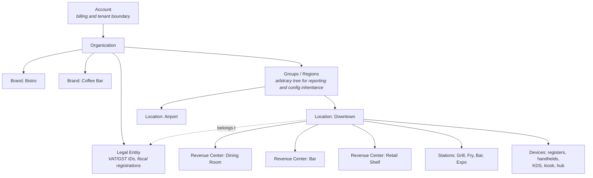
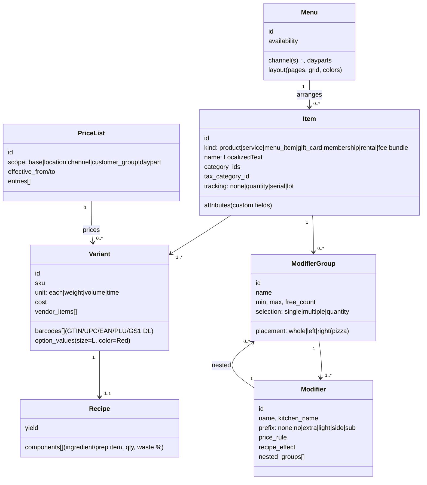
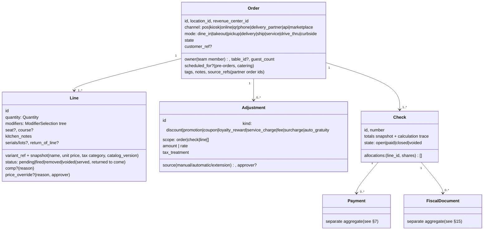
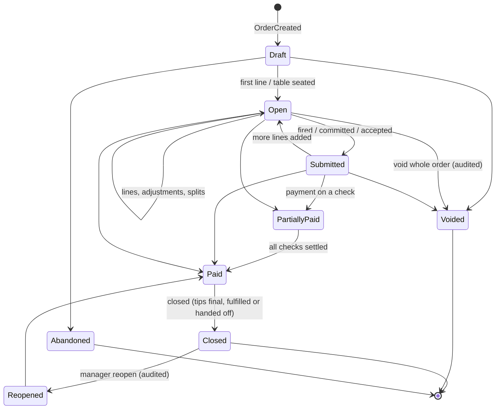
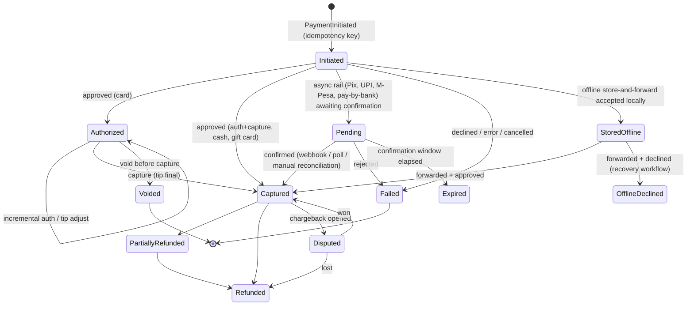

# Keel — Core Domain Model

> Status: **Draft v1** · Owner: Architecture · Last updated: 2026-09-27
>
> This document defines the business primitives every part of Keel is built from. It is the contract that
> the Rust kernel, the device apps, the Store Hub and the cloud all implement identically. For how these
> objects replicate and stay consistent without internet, read it together with
> [offline-and-sync.md](./offline-and-sync.md).

---

## 1. Modeling principles

1. **One universal transaction.** A café sale, a table's dinner, a bar tab, an online pickup order, a
   layaway, a repair ticket, a salon appointment checkout and a B2B quote are all the same `Order`
   aggregate in different configurations. Verticals are compositions, not forks.
2. **Facts are immutable events.** Every commercial fact is an append-only, signed event. Current state
   is a projection. Nothing that touched money is ever updated in place or deleted.
3. **Money is exact.** Integer minor units for amounts; fixed-point integers (millionths) for
   quantities; exact decimals for rates; explicit, jurisdiction-configured rounding at defined points
   only. No floating point anywhere in the money path.
4. **Snapshots at the moment of truth.** An order line snapshots the name, price, tax category and
   modifier prices at the moment it was rung up. Later catalog edits never silently change an open or
   historical order.
5. **Every number is explainable.** The pricing engine emits a calculation trace ("why is this $12.47?")
   that is stored with the totals and shown to staff, auditors and the AI copilot.
6. **Offline-safe identity.** Every entity ID is a UUIDv7 minted on the device that creates it. No
   entity creation ever needs a server round-trip.
7. **Separate what contends.** Things that are edited concurrently by different people or machines
   (an order being edited by a server while the kitchen bumps it and the terminal processes a payment)
   live in separate aggregates, so they never conflict.
8. **Privacy by construction.** Personal data is referenced by token and encrypted with a per-person key,
   so it can be erased ("crypto-shredded") without breaking the immutable financial record.

---

## 2. Glossary

| Term | Meaning |
|---|---|
| **Account** | The billing/tenant boundary. One merchant business, a franchisee, or a franchisor. |
| **Organization** | The operating business within an Account (most Accounts have exactly one). |
| **Brand** | A concept operated by an organization (e.g. two restaurant concepts, or a café inside a bookstore). |
| **Location** | A physical or virtual place that sells: a store, restaurant, food truck, pop-up, web store, ghost kitchen. |
| **Revenue Center** | A sub-area of a location with its own settings and reporting: bar, patio, dining room, gift shop, spa. |
| **Station** | A production point: grill, fry, cold line, bar, expo, pick-pack bench, alterations. |
| **Device** | Any enrolled hardware running Keel: register, handheld, kiosk, KDS, customer display, Store Hub appliance. |
| **Store Hub** | The software role that coordinates a location's devices on the LAN. Runs on a dedicated appliance or any capable device; fails over automatically. |
| **Kernel** | The Rust library that implements this domain model, the pricing engine, the event store and sync. Runs on every device, the hub and the cloud. |
| **Business Date** | The trading day an event belongs to, from the location's configurable day cutoff (e.g. 04:00). |
| **Order** | The universal transaction aggregate (see §6). |
| **Check** | A payment partition of an order (split bills). A quick-service order has exactly one. |
| **Line** | One item on an order, with modifiers, quantity, seat and course. |
| **Tender** | A way of paying: card, cash, gift card, store credit, house account, voucher, A2A/QR, BNPL, loyalty points, etc. |
| **Payment** | A single tender attempt against a check, with its own lifecycle (see §7). |
| **Fulfillment** | The work of delivering what was sold: kitchen tickets, picking, shipping, delivery, service. |
| **Stock Movement** | An immutable change to inventory quantity at a stock location. |
| **Stored Value** | Gift cards, store credit and other prepaid balances (a liability). |
| **Entitlement** | A right granted by a membership or package: "10 classes/month", "free drink daily", "15% off". |

---

## 3. Organization, tenancy and legal structure



- **Configuration inheritance.** Settings, menus, price lists, tax rules, permissions and receipt
  templates are defined at any level of the tree and inherited downward. A lower level can override
  them only where the upper level allows it; the upper level locks some fields and bounds others
  ("franchisees may change price ±10%"). The effective configuration for a device is computed by the
  kernel and cached locally, so it is always available offline.
- **Franchising.** A franchisee is its own `Account`: it owns its payments, payouts, customers-of-record
  and books. A `FranchiseAgreement` links it to a franchisor `Brand` and grants the franchisor:
  - governed resources, such as menu templates, recipes, promotions and brand standards;
  - read scopes, such as sales roll-ups for royalty calculation;
  - optional write scopes, such as pushing an LTO (limited-time offer) menu.

  This directly addresses the "franchisor controls everything or nothing" problem in incumbent
  systems.
- **Legal entities.** A location belongs to exactly one `LegalEntity` at a time (effective-dated).
  The legal entity carries tax registrations, fiscal-authority registrations, invoice numbering series
  and the accounting chart. This is what lets one organization run locations across countries.
- **Hybrid businesses** (café + retail, salon + product sales, brewery + taproom + merch, hotel with
  restaurant + spa + shop) are modeled with multiple revenue centers and brands in one location. One
  checkout can combine lines from different revenue centers, and reporting still splits them correctly.
- **Settlement between entities** is first-class, and every settlement is posted to the ledger (§16).
  It covers:
  - franchise royalties and ad-fund contributions, on a configurable gross or net base;
  - revenue share with concessionaires at venues and food halls;
  - **gift card and loyalty liabilities** between entities: a card sold by franchisee A and redeemed at
    franchisee B creates a settlement between them.
- **Events** (a stadium game, a festival weekend, a pop-up market day) are time-boxed scopes attached
  to a location. They can scope menus, prices, inventory, stands (revenue centers), staff and
  reporting, and they carry alcohol-cutoff and other time rules.
- **Location of sale** can differ from the registered location (food trucks, markets). The device's
  declared or geofenced sale location drives tax jurisdiction for that session.

---

## 4. Value types

These are implemented once in the kernel and exposed through generated bindings, so every platform
behaves the same way. The first nine are built, in the `keel-types` crate (`core/crates/keel-types`).

| Type | Definition | Notes |
|---|---|---|
| `Id<T>` | UUIDv7 (RFC 9562), tagged with the entity type | Minted on the creating device by a monotonic generator (12-bit counter, 62 random bits). Never reused. Opaque to clients. Reveals its creation time. |
| `Money` | `{ minor: i64, currency: Currency }` | Minor units per ISO 4217 (JPY 0, USD 2, KWD/BHD/OMR/JOD/TND 3), from Keel's verified currency table. Checked arithmetic and no operators; currencies never mix. Products are computed exactly (up to 192 bits), then rounded once. |
| `Decimal` | 96-bit scaled decimal | For rates, factors and prices per unit. Never `f32`/`f64`. |
| `Quantity` | `{ micros: i64, unit: Unit }` | Fixed point: millionths of the unit, so arithmetic is exact and the value is an integer on every platform. Units cover count, mass, volume, length, area and duration, each exactly defined (1 lb = 453.59237 g); conversions round once, explicitly. Packaging ("case of 24", "750 ml bottle") is catalog data, not a unit. |
| `Rate` | `Decimal` fraction | Tax rates, discount %, commission %. Built exactly from percentages or basis points. |
| `Hlc` | `{ wall_ms: 48 bits, logical: 16 bits }`, packed in a `u64` | Causal order across devices despite clock skew. Ties between devices are broken by `(origin_device, origin_seq)`, so the HLC carries no node ID. A remote HLC too far ahead is rejected, never adopted. See the sync doc. |
| `Timestamp` | UTC, µs since the Unix epoch (`i64`) | 0001-01-01 to 9999-12-29. Stored in UTC; rendered in the location time zone. Read through an injected `Clock`, never directly from the OS. |
| `BusinessDate` | Calendar date | Assigned at origin by the location's `BusinessDayPolicy`: an IANA time zone (from the bundled database) and a local cutoff time. Daylight saving safe. Immutable on the event. |
| `RoundingRule` | `{ mode, increment }` | Seven modes: half away from zero, half even, half toward zero, away from zero, toward zero, ceiling, floor. The increment covers cash rounding (0.05 CAD/AUD/CHF, 0.10 NZD). Where a rule applies (line, document or tender) is jurisdiction policy. |
| `Locale` / `Language` | BCP-47 tags | Per staff member (UI), per customer (receipts), per station (kitchen). |
| `LocalizedText` | Map `Language → string` with fallback | Item names, modifiers, receipt text. |
| `Address`, `Phone`, `Email` | Structured; E.164 phones | Always behind the PII vault when tied to a person (§14). |

**Rounding happens in exactly five places**, each with an explicit rounding mode from the location's
pricing rules or the jurisdiction profile ([ADR-0014](../adr/0014-pricing-engine-v0.md)):

1. extension: a unit price times a fractional quantity, for items sold by weight or measure;
2. percentage discounts;
3. allocation of order-level amounts (discounts, and tax rounded per document) to lines, and of
   a shared line to the checks sharing it, using largest remainder so the parts always sum to the
   whole;
4. tax calculation (per line or per document, as the jurisdiction requires);
5. cash tender rounding.

Anywhere else, rounding is a bug.

---

## 5. Catalog



### 5.1 Items and variants
- An **Item** is what the merchant thinks of as "a thing we sell". It has one of these kinds:
  - `product` (physical goods);
  - `menu_item` (made-to-order food and drink, usually recipe-driven);
  - `service` (has a duration, required resources and staff skills);
  - `gift_card`, `membership`, `rental` (return-state lifecycle, deposits, late fees);
  - `fee` (bag fees, bottle deposits, corkage, delivery fees);
  - `bundle` (combos, kits, meal deals: fixed or choice-based components with price allocation
    rules).
- A **Variant** is the sellable, stockable unit (the SKU). Every item has at least one. Matrix
  products (size × color) generate variants from option sets. There is no limit on option dimensions,
  and variants can be generated lazily so a 10×12×4 matrix doesn't create 480 records up front.
- **Barcodes** are a list per variant: GTIN-8/12/13/14, PLU, internal codes, supplier codes, and
  **GS1 Digital Link / DataMatrix**. 2D codes carry lot and expiry; the kernel parses GS1 Application
  Identifiers and can block the sale of expired lots.
- **Weighted and variable-measure items** declare a unit price per UoM. Price-embedded barcodes
  (EAN-13 with prefix 2x, UPC-A prefix 2) are decoded by configurable rules.
- **Tracking modes:**
  - `none` (services, most menu items);
  - `quantity`;
  - `serial` (electronics, firearms, rentals; each unit has an identity);
  - `lot` (lot and expiry for grocery, pharmacy and cannabis).
- **Units of measure** form a conversion graph (case → inner → each; board-foot ↔ linear foot; g ↔
  oz). Items can be stocked, sold and purchased in different units. **Case breaking** (selling one
  bottle from a 12-bottle case) is an audited inventory event.
- **Pass-through amounts** (bottle and container deposits, e.g. California CRV; core charges in auto
  parts; bag fees where they are levies) are `fee` items flagged as **liabilities, not revenue**, with
  their own tax treatment and return flows.
- **Regulated identifiers**: package UIDs (e.g. cannabis seed-to-sale tags), fitment data (ACES/PIES)
  and pharmacy NDCs are typed attributes with validation.
- **Custom fields** (typed, validated, localizable) exist on every catalog object. They are available
  to the API, extensions, reports and receipts.

### 5.2 Modifiers
- Modifier groups have `min`/`max` selections, `free_count` ("first 3 toppings free"), defaults,
  per-variant pricing ("extra shot: $0.75 on small, $1.00 on large") and quantity selection
  ("2× extra cheese").
- **Nesting is unlimited but rendered flat for speed.** A modifier can own modifier groups
  (Steak → Temperature; Side → Dressing). The POS UI supports forced groups (a modal only for
  required choices), inline chips and keyboard shortcuts.
- **Placement** supports halves, quarters and whole for pizza-style items, with configurable half
  pricing (max, average, or sum of halves).
- **Prefixes** (`no`, `extra`, `light`, `side`, `sub`) are data, not free text. The kitchen display
  can bold, color or group them, and they drive recipe effects: `no onion` removes onion from the
  theoretical depletion; `extra cheese` adds 1× cheese.
- Each modifier has a separate **kitchen name**, optionally in the station's language.

### 5.3 Menus, layouts and availability
- A **Menu** arranges catalog items for a channel and daypart: POS grid pages, online menu, kiosk
  menu, QR menu, delivery-partner menu. Items appear on many menus. Changes to an item (like "86'd")
  apply everywhere at once.
- **Availability** is a first-class, event-sourced state per `(item|variant|modifier, location,
  channel)`: available, 86'd until end of day, 86'd until a time, limited-quantity countdown, or
  hidden. It supports "auto-86 when stock hits 0".
- **Layouts** (button grids, colors, images, sizes and keyboard/scanner mappings) are part of the
  menu and can differ per device role and per staff role.

### 5.4 Pricing data
- **Price lists** are layered. The effective price of a variant is resolved in this order, first
  match wins: explicit line override → customer-specific or contract price list → channel list →
  daypart list (happy hour) → location list → base price.
  - Each list is effective-dated, so price changes can be scheduled.
  - Governance bounds (from franchise agreements) are enforced at authoring time.
- **Cost** is tracked per variant per location (moving average or FIFO, per organization setting)
  for margin reporting.

### 5.5 Versioning and publishing
- Catalog editing happens in drafts. **Publishing** produces an immutable, content-addressed
  `CatalogVersion` (per scope) that devices sync as snapshot + deltas.
- Every order line records the `catalog_version` it was priced against, which gives perfect
  reproducibility for audits and disputes.
- Scheduled publishes (e.g. "new menu goes live Monday 06:00 local") are distributed ahead of time
  and activated locally by the kernel at the effective time, even if the store is offline at that
  moment.

---

## 6. Orders — the universal transaction

### 6.1 Structure



Key decisions:

- **Order ≠ Check.**
  - An `Order` is the service record: everything the table, customer or ticket asked for.
  - A `Check` is a payment partition of the order's lines. Quick service has 1 order = 1 check.
  - Full service can split by seat, by item, evenly, by arbitrary amount, or by fraction of a line
    ("split the wine three ways").
  - A split never duplicates lines. Lines are **allocated** to checks in whole shares, an exact
    fraction of the line (§6.5). The kernel allocates money with largest-remainder rounding so the
    parts always sum to the line total to the cent.
  - Re-splitting after partial payment is allowed. Paid allocations are frozen and the rest can be
    re-partitioned.
- **Removed vs voided.** Before a line is fired or committed (sent to the kitchen, or inventory
  committed), removing it is a clean `LineRemoved`. After that, it can only be `LineVoided` (with a
  reason and, per policy, an approver) or `LineComped` (a zero-price give-away with a reason code).
  These distinctions drive loss-prevention analytics and kitchen waste tracking.
- **Seats and courses** are optional attributes. When used, courses fire independently ("fire
  mains"), with optional auto-fire timers per course.
- **Orders span devices.** A server starts on a handheld, the bartender adds drinks at the bar
  terminal, and the guest pays at the table on a pay-at-table device or their phone. It's all one
  order aggregate. One device **owns** the order for structural and money operations, and anyone can
  add lines. Ownership moves with one tap; see [offline-and-sync.md §5](./offline-and-sync.md#5-check-ownership-and-conflict-semantics).

### 6.2 Lifecycle



The stages up to Submitted are derived from the order's lines rather than stored (§6.5). An order
whose lines were all removed or voided is back in Draft. It can still be voided, but it can be
abandoned only if none of its lines was ever fired: an order the kitchen worked on always ends up
voided, so reports see it.

Fulfillment state (kitchen, pickup, delivery or shipping) runs in **separate aggregates** that
reference the order (§9). Order payment state and fulfillment state are independent: an online order
can be paid before it is prepared, and a dine-in order is prepared before it is paid.

### 6.3 How every business pattern maps onto `Order`

| Pattern | Configuration |
|---|---|
| Quick service / retail sale | 1 order, 1 check. `mode=takeout`. Lines committed at payment. |
| Full-service table | `table_id`, seats, courses. Many checks. Lines fired to the kitchen before payment. |
| Bar tab | Order with a pre-authorized card payment in `authorized` state. Incremental auth as the tab grows; captured at close with the tip. Walkout policy auto-closes at the configured time. |
| Online / QR / kiosk / delivery partner | `channel` set. Typically paid first. `scheduled_for` for order-ahead. `source_refs` holds the partner order ID. |
| Layaway / deposit | Order in `Submitted` with partial payments. Inventory `reserved` (not sold). Released when paid in full or on cancellation policy. |
| Quote / estimate | Order flagged `quote=true`: no inventory commitment, no fiscal document. It has an expiry and converts to a live order in one action. |
| Special order | A line with `fulfillment=special_order` creates a purchase-need for the vendor. A deposit is optional. The customer is notified on receipt. |
| Work order (repair, alterations, lab jobs) | Order linked to an **inbound custody job** (§11.7): intake condition, estimate approval, parts reservation, stages, customer notifications, pickup. |
| Appointment checkout | A `Booking` (§11) links to an order. The deposit taken at booking is applied as a payment. |
| Rental | Order linked to an **outbound custody job** (§11.7): serialized unit, rate ladder, hold or deposit, return inspection, late and damage fees. |
| Multi-date delivery (furniture, catering, B2B) | Lines are grouped into **fulfillment groups**, each with its own date, slot or ship method. Partial fulfillment and balance-due alerts are supported. |
| Return / exchange | A **new order** with negative lines referencing the original `line_id`s (refunds use the originally allocated net price, tax and discount). An exchange nets return and sale lines in one order. Receipt-less returns are governed by policy (§6.4). |
| Catering / event | `scheduled_for` in the future, deposits, a delivery or setup fulfillment, and optionally BEO-style (banquet event order) notes. |
| B2B / house account | A customer with a house account. Tender is `house_account` with net terms. Invoice document issued. Tax-exempt certificate referenced. |

### 6.4 Returns policy engine
Return policies are data. They are evaluated by the kernel so they work offline:
- return window per category;
- receipt required vs lookup by card/phone/email;
- refund-to-original-tender vs store credit;
- restocking fees;
- final-sale flags;
- a per-customer limit on receipt-less returns (needs an online check; degrades to a
  manager-approval requirement offline);
- and serial and lot validation.

Every return records the original sale reference when known. This protects against over-refunds:
a line can never be refunded beyond its originally paid net amount, across any number of partial
returns and channels.

### 6.5 As built: order events v1

`keel-domain` implements the first part of this section: creating an order, changing its
attributes, its lines, splitting them among checks, and closing checks and orders
([ADR-0015](../adr/0015-checks-and-payments.md)); payments are in §7.1. Adjustments, ownership,
and the PartiallyPaid and Paid stages come later. Payloads follow
[ADR-0013](../adr/0013-event-payloads-and-schema-evolution.md), and their key tables are in
`core/crates/keel-domain/src/order/events.rs`.

| Schema (version 1) | What happened |
|---|---|
| `order.created` | The order was opened, with its channel, mode and currency, and optionally its revenue center, table, guest count, customer and owner. |
| `order.attributes_changed` | Its mode, revenue center, table, guest count, customer or owner changed. |
| `order.line_added` | A line was added: the item as the catalog priced it (variant, catalog version, name, tax category and unit price), its quantity and modifiers, and optionally its seat, course and notes. |
| `order.line_changed` | A pending line's quantity, modifiers, seat, course or notes changed. |
| `order.line_removed` | A line was taken off before it was fired. |
| `order.lines_fired` | Lines were sent to be prepared. |
| `order.line_voided` | A fired line was voided, with a reason. |
| `order.line_comped` | A line was given away, with a reason. |
| `order.voided` | The whole order was voided, with a reason. |
| `order.abandoned` | An order was dropped before anything in it was fired. |
| `order.check_opened` | A check was opened, besides the main check every order has. |
| `order.lines_allocated` | Lines were allocated to checks: each line listed now belongs to the checks listed for it, in whole shares. |
| `order.check_closed` | A check was closed: what it was charged (each line's part, with its gross, net and tax; each tax's taxable amount and tax; the total), the version of the pricing rules, and the payments that settled it. |
| `order.closed` | The order was closed: every check holding a live line was closed. |
| `order.reopened` | A closed order, or one with closed checks, was reopened, with a reason: the order and every check are open again. |

- **A line's life.** A line is *pending* until it is fired, then *fired*. A pending line can be
  removed; a fired line can only be voided. Removed and voided lines no longer count, but a line
  remembers whether it was ever fired. A comp is a mark on a live line, pending or fired, rather
  than a status: the line is still served, at no charge. *Served* and *returned* arrive with
  fulfillment and returns.
- **Stage** is derived from the lines: *Draft* with no live lines, *Open* while a live line is
  pending, *Submitted* when every live line is fired. An active order can be voided at any stage.
  It can be abandoned only if nothing in it was ever fired: every line it had was removed first.
- **Money and units.** An order has one currency, fixed when it is created. Every price in it,
  modifiers included, is in that currency, and a line's quantity keeps the unit it was added
  with. Quantities are positive and prices are zero or more; returns will have their own events.
- **Checks.** Every order has a *main check*, number 1, whose identifier is the order's own;
  more are opened as needed, numbered in the order they were opened. Each live line belongs to
  one or more checks in whole shares, in lowest terms: one share on one check for a line one
  party pays for, one share on each of three checks for a bottle of wine split three ways. A
  new line goes to the first open check, the main check unless it is closed; when every check
  is closed, it goes to a new check opened for it, a *post-close check*. `order.lines_allocated`
  moves or splits lines.
- **Pricing:** each check is priced as its own sale (§8.1). Its *basket* holds the live lines
  allocated to it, with the prices they were rung up with; a shared line contributes the check's
  part of it. A comped line is in the basket at no charge. The whole order's basket prices it as
  one sale, as a one-check order is paid.
- **Closing a check.** A check closes once its captured payments cover its total and none of
  its payments is unresolved; checkout decides it (§7.1). Its snapshot records what pricing
  charged it then, line by line and tax by tax, and the payments that settled it: receipts, the
  ledger and returns read the snapshot, never a recomputation. A closed check freezes what its
  lines cost, and where they are paid: their quantity, modifiers, removal, void, comp and
  allocation. Their seat, course and notes can still change, and they are still fired, so an
  order paid first is still prepared.
- **Closing the order.** The order closes once every check holding a live line is closed. A
  closed order takes no command but a reopening. Reopening, with a reason, makes the order and
  every check open again, so the lines can change and the checks close again with new
  snapshots; the old ones stay in the log. A voided or abandoned order is final.
- **Commands** are checked against the device's view of the order. A command needs a created,
  active order at the device's location. Prices must be in the order's currency, and a change must
  change every field it gives. Removing or changing a line needs it pending; voiding needs it
  fired; comping needs it live and not yet comped; abandoning needs every line removed before it
  was fired. A check is opened with an identifier not yet in use; an allocation needs live lines
  and existing, open checks, and must change each line's allocation. What a line on a closed
  check costs can't change, and the line can't move; an order with a closed check can't be
  voided or abandoned: reopen it first. Closing the order needs a live line, and every check
  holding one closed; reopening needs the order, or one of its checks, closed.

**Concurrent edits** fold by the rules of
[offline-and-sync.md §5.2](./offline-and-sync.md#52-conflict-rules). Every event stays in the log;
the conflicts listed are derived by the fold, identically on every replica:

| Situation | Outcome | Conflict |
|---|---|---|
| The order is created twice | The first creation wins | `DuplicateCreation` |
| An event comes before the creation, or from another location | Not applied | `BeforeCreation`, `WrongLocation` |
| A line is added twice | The first wins | `DuplicateLine` |
| An event refers to a line the order doesn't have | Not applied | `UnknownLine` |
| A line or modifiers in another currency, or a quantity in another unit | Not applied | `CurrencyMismatch`, `UnitMismatch` |
| A line is changed after it was fired | Applied | `ChangedAfterFire` |
| A line is changed after it was removed or voided | Not applied: the removal wins | `ChangedAfterRemoval` |
| A fired line is removed rather than voided | Removed | `RemovedAfterFire` |
| A removed or voided line is fired | It stays off, and the kitchen should be told | `FiredAfterRemoval` |
| A removed or voided line is comped | No effect | `CompedAfterRemoval` |
| A line is removed or voided twice, or comped twice | The first wins | — |
| Lines are added or fired after the order was closed, voided or abandoned | Applied; an added line goes to an open check, or a new post-close check | `AddedToClosedOrder`, `FiredOnClosedOrder` |
| The order is voided or abandoned twice | The first wins | — |
| The order is voided or abandoned after it was closed | Voided or abandoned; checkout reports its payments | — |
| The order is closed or reopened after it was voided or abandoned, or closed twice | No effect | — |
| The order is abandoned although a line is live, or was ever fired | Abandoned | `AbandonedWithLines` |
| Two devices change the same attribute | The later change in canonical order wins, field by field | — |
| Two devices split a line differently | The later allocation in canonical order wins | — |
| An allocation names a check that doesn't exist yet | Not applied to the lines it names | `UnknownCheck` |
| A check is opened twice, or with the main check's identifier | The first opening wins | `DuplicateCheck` |
| A removed or voided line is allocated | No effect | — |
| A check is closed again | The first close stands | `DuplicateClose` |
| A check is closed with amounts in another currency | Not applied | `CheckCurrencyMismatch` |
| A close charges for a line that isn't on the check: moved, removed or voided concurrently | The snapshot stands | `ChargedOffCheck` |
| A close leaves out a line on the check, added or moved there concurrently | The line's part moves to the first open check that doesn't hold part of it, or to a new post-close check | `LeftOffCheck` |
| A line on a closed check is changed in quantity or modifiers, removed, voided or comped | Applied: the kitchen must know. The snapshot stands | `ChangedOnClosedCheck` |
| An allocation moves a line onto or off a closed check | Not applied to that line | `AllocatedOnClosedCheck` |
| The order is closed while a check holding a live line is open | Closed; that check's lines are unpaid | `ClosedWithOpenCheck` |

A post-close check's identifier is that of the event that opened it, so every replica opens the
same one.

---

## 7. Payments

A `Payment` is its own aggregate. Its lifecycle is driven by the payment connector and is independent
of order edits, so a server adding a dessert never conflicts with a terminal capturing a payment.



Payment record fields include:
- the tender type and connector, the amount, tip, surcharge, cashback and currency (plus tender
  currency and FX rate for foreign-cash acceptance);
- entry mode (tap, dip, swipe, keyed, wallet, QR, SoftPOS), card brand, last 4 digits and funding
  type;
- processor references, auth code, and the EMV receipt data the networks require (AID, application
  label, TVR/TSI where applicable);
- an offline flag and offline risk-limit decision, and the approving team member for overrides;
- and the network token or card-on-file token reference. Keel never sees or stores PANs.

**Tender eligibility is per line.** Some tenders may only pay for certain lines:
- SNAP and WIC: approved-product lists, jurisdiction- and date-specific;
- FSA/HSA: IIAS healthcare subtotal;
- meal vouchers: eligible food and daily caps;
- campus meal plans, restricted gift cards and promotional credits.

The checkout computes **eligible subtotals** per tender from rule packs (§15), allocates split tenders,
and passes required subtotals (e.g. the IIAS healthcare amount) in the authorization.

**External-account tenders** charge an account held in another system:
- hotel room charge to a PMS folio (by guest profile or paymaster);
- campus card declining balances and meal swipes;
- third-party vouchers.

They all follow one flow: `lookup → authorize → post → confirm | void`. An offline queue and limits
apply, and the external system is modeled as a ledger counterparty.

**Authorization validity is tracked.** Pre-auth holds expire under card-network rules. Long-lived
holds (multi-week rentals, hotel stays) are re-authorized before expiry, or fall back to a
card-on-file merchant-initiated charge. Visa and Mastercard tolerance tables decide when a tab
requires an incremental authorization before capture.

Tenders are plugins that implement one interface (authorize, capture, adjust, void, refund, status
query, reconcile). Built-in tenders are cash, card (integrated, semi-integrated, SoftPOS), gift card,
store credit, loyalty points, house account and external/manual (e.g. check or a third-party voucher).
Region packs add A2A/instant (Pix, UPI, FedNow request-to-pay, SEPA Instant), QR wallets, mobile
money, meal vouchers, EBT and BNPL. See [payments.md](./payments.md).

**Idempotency is structural.** A payment's identifier is the idempotency key that every request
for it carries, and `payment.initiated` records it (ADR-0015). A device crash, sync replay or
network retry can never double-charge. Status queries reconcile any "unknown outcome" before a
new attempt is allowed on the same check.

### 7.1 As built: payments v1

`keel-domain` implements payments in cash and by card
([ADR-0015](../adr/0015-checks-and-payments.md)): the payment aggregate, and *checkout*, the
rules that span an order and its payments. The payloads' key tables are in
`core/crates/keel-domain/src/payment/events.rs`.

| Schema (version 1) | What happened |
|---|---|
| `payment.initiated` | A payment was started: its order, check, tender (cash or card) and amount. |
| `payment.authorized` | A card was authorized for an amount, with the processor's reference. |
| `payment.captured` | The money moved: the amount applied to the check, a tip on top, the processor's reference, and for cash the amount tendered and any cash rounding. |
| `payment.failed` | The attempt failed, with a reason, such as a decline or a cancellation: no money moved. |
| `payment.voided` | The payment was voided before it was captured, with a reason: no money moved. |

- **The state machine.** A payment is initiated, then authorized, captured, failed or voided;
  an authorized payment is then captured, failed or voided. An initiated or authorized payment
  is *unresolved*: money may still move.
- **Commands** record an outcome of an unresolved payment at the device's location. Only a card
  is authorized, once, for no more than was asked; a capture is for no more than the
  authorization, or than was asked. A cash capture records the amount tendered and a card
  capture doesn't; cash never has a processor reference.
- **Checkout** sees an order together with its payments and the location's pricing rules. A
  check's *balance* is its total (the snapshot's once it is closed, the current pricing's before)
  less its captured payments in the order's currency; tips are on top. A payment starts only on
  an open check of an active order with no unresolved payment, for no more than the balance, so
  an unknown outcome is resolved before any new attempt. A check closes only with no unresolved
  payment, and captured payments that cover its total.
- **Issues.** Money that doesn't fit the order is reported, never hidden: the payments stand,
  and a manager decides. Checkout reports a payment for a check the order doesn't have, one in
  another currency, one captured or unresolved on a voided or abandoned order, and one captured
  or unresolved on a check that closed without it; and a check overpaid, or closed and no longer
  covered.
- **Not yet built:** refunds, returns and disputes; store-and-forward and asynchronous rails;
  tip adjustment and incremental authorization; other tenders; receipt details such as card
  brand, entry mode and EMV data, which come with the first connector.

Outcomes recorded concurrently fold by these rules, and every event stays in the log:

| Situation | Outcome | Conflict |
|---|---|---|
| A payment is initiated twice | The first stands | `DuplicateInitiation` |
| An outcome comes before the initiation, or from another location | Not applied | `BeforeInitiation`, `WrongLocation` |
| An outcome has money in another currency than the payment's | Not applied | `CurrencyMismatch` |
| Anything is recorded after a capture | The capture stands: the money moved | `OutOfTurn` |
| An authorization or a capture after a failure or a void | Applied: the card may be held or charged, and an authorized payment is unresolved again | `OutOfTurn` |
| A second authorization, or a failure or void after a failure or void | No effect: no money moved either way | — |

---

## 8. Pricing and tax calculation

The pricing engine is a **pure, deterministic function** in the kernel:

```
calculate(order_snapshot, effective_config, catalog_version, customer_context, clock)
  -> Totals { per_line, per_check, per_tax, adjustments, rounding, trace }
```

It runs on the device for instant feedback. It runs again on the hub or cloud whenever an order
arrives from another channel. And it runs in tests against golden vectors, with the same code and the
same result everywhere.

**Pipeline**, in fixed order:
1. **Base price resolution** through the price-list layers (§5.4). Includes weighted and variable
   measure pricing.
2. **Modifier pricing**: per-variant, free-count, half/whole placement.
3. **Manual overrides** (permission- and limit-checked).
4. **Promotions**:
   - Candidate promotions are selected by conditions: items, categories, quantities, spend
     thresholds, customer segment, membership, channel, daypart, coupon code and custom-extension
     predicates.
   - The engine resolves the best **combination** under stacking and exclusivity rules. The
     objective is either "best for customer" or merchant-defined priority. Mix-and-match and BOGO
     use a bounded optimizer with deterministic tie-breaking.
   - Discounts are **allocated to lines**, so tax and future returns are exact.
5. **Service charges, fees and surcharges**, each with its own tax treatment. Examples: auto-gratuity
   for parties ≥ N, delivery fee, bag fee, bottle deposit, card surcharge. Surcharges and dual pricing
   follow the rules engine in the compliance profile; card-brand and state or country constraints are
   enforced (see [compliance.md](./compliance.md)).
6. **Tax**:
   - Jurisdiction rule sets map tax categories to rates. The engine supports:
     - inclusive (VAT-style) or exclusive (US-style) pricing;
     - multiple and compound taxes (e.g. federal + provincial);
     - thresholds (e.g. clothing under a price cap exempt), tax holidays and exemptions
       (customer certificates);
     - takeout vs dine-in rates (many VAT countries), and prepared-food and alcohol rules;
     - rounding per line or per document.
   - Destination-based tax for delivery and shipping uses a cached rate table or an online tax
     engine connector, with a fallback when offline.
7. **Cash rounding**, applied only when the tender is cash and the jurisdiction requires it.
8. **Tip suggestions** computed on a configurable base (pre-tax or post-tax, before or after
   discounts), with presets and a truthful "no tip" option. See the UX principles in the vision doc.

The output **trace** is a compact structured log, for example: "Line 3: base $9.00 (location price
list 'Downtown') + modifier 'extra shot' $0.75 − promo 'Happy Hour 20%' $1.95 → $7.80; tax 'NYC
combined 8.875%' $0.69". The trace is stored alongside the check totals.

### 8.1 As built: pricing v0

`keel-pricing` implements the first version of this pipeline for counter service at one US
location ([ADR-0014](../adr/0014-pricing-engine-v0.md)). Pricing is a pure function from a
*basket*, the order's live lines as they were rung up, and the location's rules to the totals.

- **Prices come from the line's snapshot.** Base price resolution (step 1) and the modifier
  group's rules (free selections, half pricing) happen when a line is rung up, with the catalog,
  and aren't repeated when totals are computed.
- **Extension:** the item's price plus its modifiers', each modifier counting its quantity times
  its own price plus its nested modifiers', times the line's quantity. Only a fractional quantity,
  for an item sold by weight or measure, needs rounding.
- **Shares:** a line split among checks is priced in each check's basket as that check's part:
  the line's gross is split by largest remainder in proportion to the checks' shares, in the
  order of their identifiers, so the parts add up to the line
  ([ADR-0015](../adr/0015-checks-and-payments.md)). Each check is then taxed as its own sale.
- **Comps and discounts** stand in for manual overrides and promotions (steps 3 and 4). A comp
  takes the whole line, or the whole part. Line discounts, then order discounts, each take from
  what is left: a percentage is rounded, and an amount is never more than what is left. Each
  order discount is allocated to the lines by largest remainder, so the shares add up to it
  exactly.
- **Tax** (step 6): each tax applies to lines in its categories, optionally only when the order is
  eaten on the premises or only when it is taken away, on the line's net. It is added to the
  price, and rounded per line or once per document; a per-document tax is allocated to the lines.
  Taxes don't compound, and a customer can be exempt from some of them.
- **Cash rounding** (step 7) is a separate function, which the tender calls on the amount paid in
  cash.
- **The totals** give every line's gross, comp, discounts, share of each order discount, net and
  taxes, and the order's totals. The **trace** records every step with its inputs and result.
- **Not yet built:** price lists, the catalog's modifier rules, promotions, service charges, fees
  and surcharges, tips, tax-inclusive (VAT) prices and compound taxes, per-item thresholds, tax
  holidays, the SNAP portion, manufacturer coupons, destination-based tax, and returns.

---

## 9. Fulfillment and kitchen

Fulfillment is modeled separately from ordering and payment so that production and delivery can
proceed (and conflict) independently.

- **KitchenTicket** aggregates are created when lines are fired. **Routing rules**
  (`item/category/modifier × revenue center × order mode × daypart → station(s)`) decide:
  - which stations get the ticket;
  - how an item is split into components across stations (burger to grill, fries to fry);
  - and what the expo view shows.

  Every station action is an event on the ticket: `started`, `item_ready`, `bumped`, `recalled`,
  `rushed`, `priority_changed`. It never mutates the order.
- **Timing**:
  - Per-item cook times allow **synchronized firing**, so the steak and the salad for one table
    finish together.
  - Course holds and auto-fire timers are supported.
  - Throttling and pacing use kitchen load (open items per station) to quote realistic ready times
    to online and kiosk channels.
- **All-day counts, allergen flags** (structured allergens from the catalog, not free text), rush
  flags, and seat or position labels.
- **Pickup and delivery**: `Handoff` aggregates track ready → picked up / out for delivery →
  delivered, with courier and ETA integration for first-party delivery and marketplace couriers.
  They drive customer-facing order-status boards and SMS notifications.
- **Retail fulfillment**: `PickTask` (BOPIS, ship-from-store) and `Shipment` (carrier label,
  tracking), with reservation of stock at order time.
- **Service tickets**: stage-based work orders for repairs, alterations and grooming, with
  customer notifications at stage transitions.
- **Fallback routing** is part of the model. When a station's KDS or printer is unreachable, the
  ticket reroutes to a designated backup device or printer, and staff are alerted.
- **Speed-of-service instrumentation**: every order records timestamps for start, send, first item
  started, bump, ready and handoff, by channel and station. A drive-thru timer API pairs a detected
  car with a transaction.

---

## 10. Inventory

Inventory is **movement-sourced**: on-hand is never stored as a mutable number, it is the sum of
immutable movements. This makes offline decrements from many devices merge trivially.

| Concept | Definition |
|---|---|
| `StockLocation` | Where stock physically lives: store floor, back room, bins, walk-in, bar, warehouse, truck. |
| `StockItem` | A variant or an ingredient (ingredients are non-sellable catalog items with purchase and recipe units). |
| `StockMovement` | `{ stock_item, stock_location, qty_delta, reason, cost?, lot?, serial?, ref }` where the reason is sale, return, receive, transfer_out, transfer_in, adjust, count_variance, waste, production_consume, production_yield, reserve or release. |
| Derived levels | `on_hand`, `reserved` (layaway, BOPIS, online carts), `available = on_hand − reserved − safety`, `in_transit`, `on_order`. |
| `Recipe` / BOM | Components with quantities, yields and waste factors; sub-recipes (prep items). Selling a menu item emits **theoretical** consumption movements, including modifier effects. |
| `ProductionBatch` | Prep or batch cooking: consumes ingredients, yields prep items with expiry (hold times). |
| `Count` | Full or cycle count sessions; blind counts. Counted quantity is recorded **as of a timestamp** and reconciled against movements that happened during counting, so stores can count while trading. |
| `PurchaseOrder` / `Receipt` / `Vendor` / `VendorItem` | Pack sizes, case vs each conversions, vendor-specific SKUs and costs, partial receipts, invoice matching (three-way match: PO, receiving, invoice). |
| `Transfer` | Store-to-store or warehouse-to-store with in-transit state and discrepancy handling. |
| `Forecast` / `ReorderPolicy` | Min/max, days-of-cover, or forecast-driven suggestions (AI, §12 of the architecture). |

**Negative stock** is allowed by default for selling (you never block a sale because a count was
wrong). It is flagged for review. Merchants can opt into hard blocks for serialized or lot-controlled
goods and for regulated purchase limits.

**Limited-quantity items** ("12 croissants left", "5 specials left") use an *escrow* model across
devices so offline terminals can't oversell by more than a configured tolerance. See consistency
class C in the sync doc.

---

## 11. Customers, stored value, loyalty, memberships, bookings

### 11.1 Customer
- An org-wide profile: name, contact points, addresses, consent records (marketing, receipts,
  profiling) per channel, tags, notes, preferences (allergens, favorite table, size profile), segment
  memberships, tax exemptions, and linked payment tokens (card-on-file via the processor vault).
- **Identity resolution** merges duplicates (same phone/email/card fingerprint) with a reversible,
  audited merge.
- **Customer graph**: people, households and organizations (B2B buyers with roles), plus
  **dependents and assets** with typed attributes. Examples:
  - pets: breed, size, vaccination expiry;
  - vehicles: VIN, fitment;
  - devices: serial or IMEI;
  - students: plan;
  - patients: prescriptions;
  - skiers: height, weight, ability.

  Attributes can **gate actions** through rule packs. For example, an expired vaccination blocks a
  grooming booking.
- **Waivers, consents and tax-exempt certificates** are versioned documents attached to the profile,
  with jurisdiction and expiry. An expired certificate automatically brings tax back on the sale.
- PII lives in the **PII vault** (§14). Devices cache a minimal, encrypted lookup subset.

### 11.2 Stored value (gift cards, store credit)
- A `StoredValueAccount` is a ledger of events: `issued`, `loaded`, `redeemed`, `refunded_to`,
  `expired`, `adjusted`, `escheated`. Its balance is a projection.
- Physical cards (barcode, magstripe, NFC), digital cards (wallet passes, email/SMS) and
  **multi-merchant/franchise-wide** acceptance with inter-entity settlement.
- The cloud is authoritative. Offline redemption is allowed up to an **offline escrow**: a per-card
  limit plus a per-device aggregate limit set by the merchant. Overdrafts detected at sync time create
  a receivable and an alert. See consistency class D.

### 11.3 Loyalty
- Programs: points-per-currency, visits, item-based ("10th coffee free"), tiers with qualification
  windows, cashback, and paid tiers.
- Accounts are ledgers (`earned`, `redeemed`, `expired`, `adjusted`, `reversed_on_return`). Earning
  rules run in the kernel and so work offline. Redemptions follow the stored-value escrow model.

### 11.4 Memberships, packages and subscriptions
- A `Membership` has a plan (price, billing cycle, commitment, freeze rules), a status, and
  **entitlements**. Entitlement types:
  - unlimited for a period;
  - counted packs with expiry: "10-class pack, valid 90 days";
  - period-reset counters: "14 meal swipes per week", "1 free drink per day";
  - benefits: "15% off retail";
  - guest passes;
  - access rights: door, turnstile or gym entry.
- **Plan options**: sharing (family plans), rollover and freezes. Cancellation and auto-renewal rules
  are configurable per jurisdiction.
- **Redemption**:
  - Consuming an entitlement is an idempotent event.
  - Offline redemption is allowed within a bounded overdraft; a double use across two offline devices
    reconciles to one valid redemption plus one flagged exception.
  - Status changes reach access-control integrations within 2 s.
- **Billing**: recurring billing runs in the cloud against tokenized cards. Dunning (retrying failed
  membership charges) and failure handling are configurable. In SCA markets, cards are set up with a
  customer-initiated SCA payment and later charged as merchant-initiated transactions carrying the
  network reference, with the consent record kept.
- Class packs, prepaid service packages ("5 massages"), coffee subscriptions and wine clubs are all
  memberships with different entitlement configurations.

### 11.5 House accounts (B2B, accounts receivable)
- A credit limit, net terms, statements, aging, and invoice documents. Payments applied against
  invoices. Contractor or trade pricing comes via customer price lists.

### 11.6 Resources and bookings
- A `Resource` is anything with bookable capacity: a table, staff member, room, chair, lane, court,
  vehicle or equipment unit. It has availability calendars, skills and tags.
- A `Service` item is a **chain of segments**. Each segment has a duration and required resources
  ("60 min massage: 1 therapist with skill=deep_tissue + 1 room"). Segments can have **processing
  gaps** during which the provider is free but the chair is not ("apply color 30 min → process 40 min
  → finish 30 min"). Multiple providers per service are allowed.
- **Capacity buckets** are also bookable: class spots, timed-entry slots, pickup slots, delivery
  windows and daily production caps (e.g. "20 custom cakes per day"). Order-ahead and bakery pre-order
  throttling use the same mechanism.
- **Concurrency**: when 50 requests race for the last slot across web, kiosk and POS, exactly one wins.
- A `Booking` covers reservations, appointments, classes (capacity N), rentals and timed tickets.
  Lifecycle: `requested → confirmed → checked_in → in_service → completed | no_show | cancelled`.
  It carries deposits, card-on-file for no-show fees, cancellation policies, reminders, intake forms
  and waitlist entries.
- The cloud is authoritative for online availability. The hub coordinates in-store edits, and
  offline double-bookings are detected and surfaced for resolution. Restaurant reservations and the
  waitlist use the same model with table resources and turn-time predictions.

### 11.7 Custody jobs (repairs and rentals)
One state machine covers goods that are **in someone else's custody**:

- **Inbound** (repair, alteration, lab job, tune-up):
  1. Intake: asset identity (serial or IMEI), condition, photos, checklist and signature.
  2. Versioned estimate, sent to the customer for approval.
  3. Parts reservation, which reduces available-to-sell stock.
  4. Labor lines with technician attribution.
  5. Stage transitions (received → diagnosing → awaiting approval → awaiting parts → in progress →
     ready → picked up). Each transition triggers a customer notification by SMS, email or WhatsApp,
     depending on the market.
- **Outbound** (rental):
  1. Check-out of a serialized asset.
  2. **Rate ladder** pricing (hour, day, weekend, week), with best-price calculation: 9 days priced as
     a week plus 2 days when that's cheaper.
  3. A hold or deposit, with authorization-validity tracking (§7).
  4. E-signed waiver.
  5. Return inspection that compares condition to check-out, and posts late and damage fees against
     the deposit.
  6. Cleaning buffers and a maintenance lockout by date or meter reading.

---

## 12. Workforce

- **TeamMember**: an org-level person record with employment details, per-location role grants, job
  codes with pay rates (a person can be a server at $X and a bartender at $Y), PIN, NFC badge,
  optional biometric enrollment (on-device only), languages, certifications (food handler, alcohol
  service) with expiry.
- **Permissions (ABAC)**. A permission is `action × resource × constraints`, for example
  `discount.apply {max_percent: 15}`, `refund.issue {max_amount: 100, own_orders_only: true}` or
  `order.void {after_fire: requires_approval}`.
  - Roles bundle permissions, and grants are scoped to organization, location or revenue center.
  - When an action exceeds a limit, the kernel requests an **approval**: a manager PIN or badge on
    the same device, or a remote approval pushed to a manager's phone. This produces an
    `ApprovalGranted` event tied to the action.
  - Everything works offline because the policies are evaluated locally.
- **Time and attendance**:
  - `TimeEntry` events cover clock in/out, breaks, job-code switches and declared cash tips.
  - The compliance profile enforces break rules, overtime, minor-labor restrictions and predictive
    scheduling rules. It warns or blocks, and records attestations.
  - Geofencing and photo clock-in are optional.
- **Scheduling**: `Shift` plans with templates, availability, time-off requests, shift swaps with
  approval, labor-budget vs forecast, and publishing to staff apps.
- **Tips**: a `TipPolicy` rules engine covers:
  - tip pools and tip-outs (percent of sales or of tips, by job code, by hours);
  - service-charge distribution (distinct from tips where law requires);
  - credit-card-fee deductions where legal;
  - and cash tip declarations.

  `TipDistribution` is computed per shift or business day with a full audit and exported to payroll.
- **Attribution**: a line can be attributed to **multiple staff with split percentages** (e.g. a
  60/40 stylist split, or a sales associate plus a technician). Attribution drives commissions, tips
  and reporting, and reverses exactly on refunds.
- **Commissions**: rules by item, category, margin or target tiers, and service vs retail. They can be
  calculated on net revenue after product ("backbar") cost. Clawbacks happen on returns. Booth-renter
  and consignment payouts are included.

---

## 13. Cash management

- `CashDrawer` (physical) and `DrawerSession` (one person or shared assignment, one device, opening
  float).
- Session events include cash sale, change given, paid-in, paid-out (reason codes), safe drop,
  no-sale open (audited, with optional reason), mid-shift count, blind close count, and over/short.
- Drawer sessions are **single-writer** (owned by the device the drawer is attached to), so they
  never conflict.
- Safe and bank-deposit tracking (bag numbers) reconcile against expected cash by business date.
- Cash-recycler and dispenser integration reports counted denominations automatically.
- Foreign-currency cash tenders are converted at a configured rate; change is given in the local
  currency.

---

## 14. Privacy: PII vault and crypto-shredding

Immutable event logs and "right to erasure" (GDPR Art. 17, CCPA deletion) conflict unless personal
data is designed out of the log:

- Events reference people by `CustomerRef` / `TeamMemberRef` tokens, never by raw PII.
- PII fields (name, email, phone, address, date of birth, ID-scan details) are stored in the **PII
  vault**. Each record is encrypted with a **per-person data key**, which is itself wrapped by a tenant
  key in a KMS.
- Devices cache the minimal encrypted subset they need (e.g. customer lookup for a location's recent
  customers), decryptable only on enrolled devices.
- **Erasure = destroying the person's data key.** Financial events remain intact and auditable; the
  person becomes an anonymous token everywhere, including in backups and replicas. Fiscal retention
  rules that require keeping buyer details on invoices (B2B) are handled by policy: those invoices
  retain their legally required fields.
- ID scans for age verification store the **result** (over 21: yes, scanned at, method), not the
  document image or data, unless a jurisdiction requires it (e.g. some cannabis rules) — and then
  only with retention limits.

---

## 15. Compliance objects

- **FiscalDocument**: a jurisdiction-specific record created by the fiscal adapter when a
  check is finalized, cancelled or refunded. It carries:
  - document type and number (per the legal numbering series);
  - the signature or seal (e.g. a TSE signature, hash-chain value or authority-issued code), the
    QR payload and any mandatory receipt fields;
  - submission status to the tax authority, and links to the order, check and payment events.

  See [compliance.md](./compliance.md).
- **AgeVerification**: method (visual, ID scan, digital ID/mDL), outcome, verifier and time. It is
  linked to the lines that required it.
- **TraceabilityRecord**: package, lot or tag identifiers for regulated goods (e.g. cannabis
  seed-to-sale package tags), reported through a compliance connector.
- **PurchaseLimitRule**: per-customer or per-transaction limits (cannabis grams, pseudoephedrine,
  ammunition), evaluated in the kernel. Limits support **category equivalency** (e.g. concentrate
  grams count as N flower-equivalent grams), rolling windows and customer class (medical vs adult
  use, resident vs non-resident). Cross-location limits need an online check, with a
  jurisdiction-specific offline policy.
- **RulePack**: rules that change with law are **data, not code**. Rule packs are signed, versioned,
  jurisdiction-scoped and effective-dated. They include:
  - tax rates and rules;
  - surcharging and dual-pricing permissions and caps;
  - SNAP, WIC and FSA eligibility;
  - age thresholds and sale-time windows;
  - purchase limits;
  - cash-rounding rules;
  - fiscal deadlines and document requirements;
  - labor rules (breaks, overtime, predictive scheduling);
  - required disclosures.

  The kernel evaluates them **offline** with explanations ("Blocked: IL adult-use flower-equivalent
  limit 30 g; cart = 31.5 g"). They are distributed as class E reference data, **ship independently
  of app releases**, reach devices within 5 minutes, and can be rolled back. A regulatory change such
  as a new SNAP waiver date or a fiscal deadline shift is deployed as data within an hour.
- **Compliance outbox**: regulated events flow through the durable, idempotent effect outbox to
  compliance adapters (seed-to-sale systems, NPLEx, lottery, scan-data programs, EBT/WIC processors,
  tax authorities). Adapters provide retries, a dead-letter queue and reconciliation against the
  authority's records. The test: a 4-hour outage loses zero submissions and creates zero duplicates.
- **AuditEvent**: security-relevant actions (logins, permission changes, approvals, exports,
  settings changes), hash-chained like all events.

---

## 16. The commerce ledger

Every domain event with a financial effect is **posted** to a double-entry ledger per legal entity,
per location and per business date, by versioned posting rules:

| Event | Debit | Credit |
|---|---|---|
| Sale paid by card | Card clearing (processor) | Revenue (by category), tax payable, tips payable, service charge payable |
| Sale paid by cash | Cash in drawer | Revenue, tax payable |
| Gift card sold | Cash / card clearing | Gift card liability |
| Gift card redeemed | Gift card liability | Revenue, tax payable |
| Refund to card | Revenue (contra), tax payable | Card clearing |
| Processor settlement | Bank (in transit) + processing fees expense | Card clearing |
| Tip payout (cash) | Tips payable | Cash in drawer |
| Offline payment later declined | Offline loss / receivable | Card clearing |
| Inventory sale (COGS) | Cost of goods sold | Inventory asset |

This is what makes these things work:
- **automatic reconciliation**: expected vs actual processor deposits, fees verified against the
  contracted pricing, and cash over/short;
- **liability reporting** for gift cards, store credit, loyalty and tips;
- **accounting exports** (QuickBooks, Xero, NetSuite, Sage, DATEV and others) at summary or detail
  level, with a merchant-editable chart-of-accounts mapping.

---

## 17. Events

### 17.1 Envelope

Every event, of every type, on every device, uses the same envelope (format 1; the exact encoding
is in [ADR-0012](../adr/0012-event-wire-format.md), and `keel-events` implements it):

```text
EventEnvelope {
  event_id        : UUIDv7         // globally unique; dedupe key
  location        : LocationId     // where it happened: the device's enrolled location
  stream          : { kind, id }   // aggregate, e.g. ("order", 0190…)
  schema          : "order.line_added/3"  // name + version
  origin_device   : DeviceId
  origin_seq      : u64            // from 1, gapless per device
  hlc             : Hlc            // causal/total ordering; increases along each device's log
  business_date   : BusinessDate
  actor           : TeamMemberRef | CustomerRef | IntegrationRef | ExtensionRef
                  | System(component)  // e.g. the scheduler closing a business day
  approval?       : EventId        // the event granting approval
  causation?      : Id             // command or event that caused this
  correlation?    : Id             // e.g. the user action spanning aggregates
  payload         : bytes          // canonical CBOR, schema-validated
  prev_hash       : [u8; 32]       // hash of previous event in this device's log
}
```

- **Signature.** The device signs the encoded envelope as a COSE_Sign1 message (RFC 9052), with
  ECDSA P-256 in secure hardware (Secure Enclave, StrongBox, TPM), or Ed25519 as a fallback. The
  event's hash covers the envelope, not the signature, so an event's identity is its content.
- **Canonical encoding** (a strict subset of deterministic CBOR) gives every event exactly one
  encoding, so hashes and signatures are reproducible on every platform.
- **Per-device hash chains** make any tampering, deletion or reordering detectable. This underpins
  fiscal inalterability requirements (e.g. France's NF525 and chained-signature regimes elsewhere) and
  loss-prevention audits.
- **Location binding.** A device is enrolled at one location, and replicas reject its events for
  any other.
- **Payloads** are canonical CBOR maps with small integer keys, decoded strictly
  ([ADR-0013](../adr/0013-event-payloads-and-schema-evolution.md)).
- **Schema evolution**: events are never rewritten. Every payload change is a new schema version.
  Kernels decode every version they know, and *upcasters* translate old versions when folding.
  Writers use a new version only once every kernel at their location knows it. Each version in
  the schema registry has a pinned example payload that tests decode, so no release can break a
  stored event.

### 17.2 Core event catalog (initial)

| Stream | Events |
|---|---|
| `order` | `OrderCreated`, `OrderAttributesChanged` (mode, table, guests, customer, owner), `LineAdded`, `LineChanged`, `LineRemoved`, `LinesFired`, `CourseFired`, `LineVoided`, `LineComped`, `AdjustmentApplied`, `AdjustmentRemoved`, `CheckCreated`, `LinesAllocated`, `ChecksMerged`, `OrderTransferred`, `OrderSubmitted`, `OrderClosed`, `OrderReopened`, `OrderVoided`, `OrderAbandoned` |
| `payment` | `PaymentInitiated`, `PaymentAuthorized`, `PaymentIncremented`, `TipAdjusted`, `PaymentCaptured`, `PaymentFailed`, `PaymentStoredOffline`, `PaymentForwarded`, `PaymentOfflineDeclined`, `PaymentVoided`, `RefundInitiated`, `RefundCompleted`, `DisputeOpened`, `DisputeResolved` |
| `kitchen_ticket` | `TicketCreated`, `TicketItemStarted`, `TicketItemReady`, `TicketBumped`, `TicketRecalled`, `TicketRushed`, `TicketRerouted` |
| `handoff`, `pick_task`, `shipment` | stage transition events |
| `custody_job` | `JobOpened` (direction in/out), `IntakeRecorded`, `EstimateIssued`, `EstimateApproved`, `PartsReserved`, `StageChanged`, `AssetCheckedOut`, `AssetReturned`, `InspectionRecorded`, `JobClosed` |
| `stock` | `StockMoved` (a single event type with a reason code), `CountStarted`, `CountRecorded`, `CountFinalized` |
| `drawer_session` | `DrawerOpened`, `CashIn`, `CashOut`, `PaidIn`, `PaidOut`, `SafeDrop`, `NoSaleOpen`, `DrawerCounted`, `DrawerClosed` |
| `time_entry` | `ClockedIn`, `BreakStarted`, `BreakEnded`, `JobChanged`, `ClockedOut`, `TipsDeclared`, `EntryEdited` (with approver) |
| `stored_value`, `loyalty`, `membership` | ledger events as described in §11 |
| `booking` | lifecycle events as in §11.6 |
| `availability` | `ItemAvailabilityChanged` (86 / un-86 / countdown set) |
| `fiscal_document` | `FiscalDocumentIssued`, `FiscalSignatureObtained`, `FiscalSubmissionAccepted`, `FiscalSubmissionRejected` |
| `audit` | `SignedIn`, `SignedOut`, `ApprovalGranted`, `PermissionChanged`, `SettingChanged`, `DataExported` |

Conflicts aren't events: each replica's fold derives them from the events
([ADR-0013](../adr/0013-event-payloads-and-schema-evolution.md)). The order events built so far,
and their schema names, are listed in §6.5.

### 17.3 Commands
Clients never write events directly. They send **commands** (`AddLine`, `ApplyDiscount`,
`StartPayment`) to the local kernel. The kernel:
1. authorizes the command (permissions and limits);
2. validates it against current state and invariants;
3. runs extension hooks (sandboxed WASM, §architecture);
4. emits one or more events atomically to the local log;
5. updates local projections.

The same command API is exposed over the Store Hub's local API and the cloud API, so integrations
behave identically in every tier.

---

## 18. Consistency class per aggregate (summary)

| Class | Meaning | Aggregates |
|---|---|---|
| **A — commutative** | Merge by union; any order of arrival converges | `stock` movements, `time_entry`, `audit`, `kitchen_ticket` actions, loyalty *earn* events |
| **B — single-writer** | Exactly one device may append; no conflicts possible | `drawer_session`, per-device fiscal chains, device-local sequences |
| **C — hub-coordinated** | Hub sequencing, ownership leases and escrow when partitioned | `order` (single owning device for structural and money operations; commutative line additions from any device), table assignment, limited-quantity availability, store-wide order numbers, in-store booking slots, `custody_job` asset check-out |
| **D — cloud-authoritative with offline escrow** | Online authority; bounded offline allowance | `stored_value`, loyalty *redemptions*, `membership` entitlements, house-account credit, online inventory reservations, online booking availability |
| **E — cloud-authored reference data** | Versioned snapshots and deltas flow down; rare local overrides | catalog, menus, price lists, tax and fiscal profiles, staff and roles, settings |

Details, algorithms and failure behavior: [offline-and-sync.md](./offline-and-sync.md).
