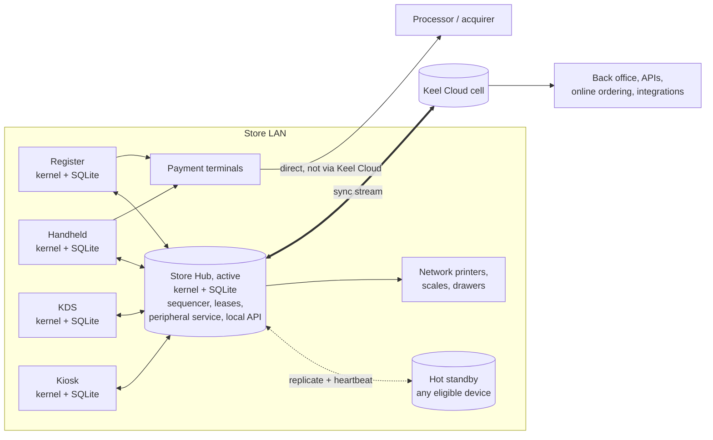
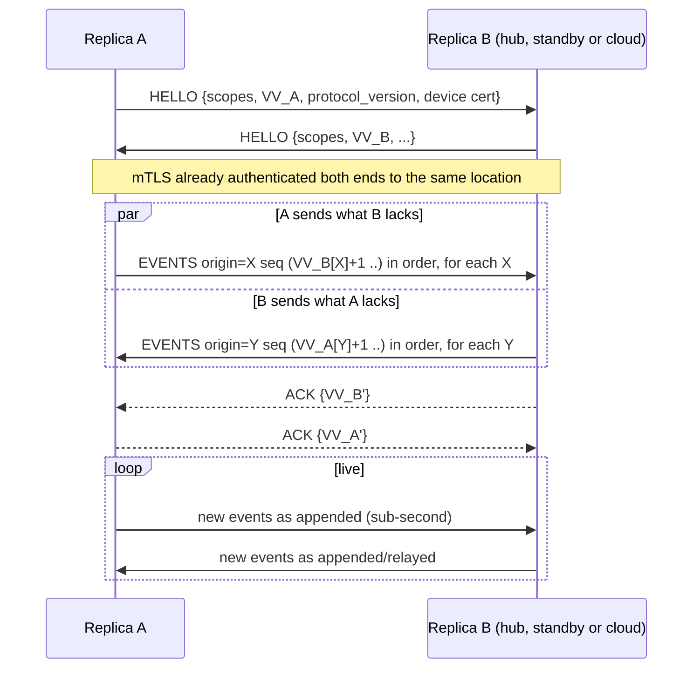

# Keel — Offline Operation and Sync

> Status: **Draft v1** · Owner: Architecture · Last updated: 2026-09-27
>
> Prerequisite: [domain-model.md](./domain-model.md). Decision records: [ADR-0001](../adr/0001-local-first-three-tier-topology.md), [ADR-0002](../adr/0002-event-sourced-signed-event-log.md), [ADR-0006](../adr/0006-own-sync-protocol.md).

## 1. The promise

> **A Keel location never stops selling.** Losing the internet, our cloud, the payment processor, the
> Store Hub or any single device degrades specific capabilities in documented, bounded ways. It never
> stops staff from ringing, firing, taking payment and closing out.

Every cloud POS markets an "offline mode", and in practice each one is a reduced subset. Typical gaps:
- no card payments, or card payments capped by time and amount;
- no new devices;
- no gift cards, loyalty or reports;
- the kitchen goes dark if devices can't reach the cloud;
- and data is lost if the device dies before reconnecting.

(Evidence: [research synthesis](../research/README.md).)

Keel inverts the design. **The store is the primary system for in-store operations, and the cloud is
the primary system for history, cross-store and back office.** Offline isn't a mode we switch into:
every in-store action works the same way with or without the internet, because none of them waits on
the cloud.

## 2. Topology

**Three tiers, one kernel**:

| Tier | Role | Authoritative for |
|---|---|---|
| **Device** (register, handheld, KDS, kiosk, customer display) | Autonomous replica: full local event store, projections and kernel. Can sell alone in island mode. | Its own event log; single-writer aggregates it owns (drawer sessions, device fiscal chains); checks it holds the ownership lease for. |
| **Store Hub** (role, not a box) | LAN authority: **sequences** the store's events into one canonical order, grants **ownership leases**, relays and fans out, runs peripherals, the local API and the cloud gateway, keeps local backup. | In-store canonical order and coordination (class C). |
| **Cloud cell** | Durable history, reference-data authoring, cross-store and online state, integrations, analytics. | Reference data (class E), cross-store balances (class D), long-term history. |

**The Store Hub is a role, not a box.**
- It runs on a dedicated Keel Hub appliance (recommended for full service, grocery and venues), or on
  any hub-eligible device: Android, Windows, macOS or Linux devices on wall power.
- It can also run as a container on a chain's existing edge cluster.
- iPads are hub-eligible only in foreground-hub mode, because iOS suspends background apps.
- **Browsers are never hubs or peers.** Browsers can't listen on sockets or do mDNS. Browser-based
  displays connect to the hub as clients.
- A **hot standby** (the next-highest-priority eligible device) keeps a fully replicated state and
  takes over in under 5 s, with **epoch fencing** (§7).
- A device that can reach neither the hub nor the cloud keeps selling in **island mode** (§5.1).
- Single-device merchants (a food truck, a market stall) run the hub role inside their only device.

This design keeps what made on-prem systems resilient (Oracle Simphony's CAPS arbitrating check
ownership; Aloha's store server with terminal takeover) and removes their weaknesses: no mandatory
server, no Windows box, no wired-only or same-subnet rules, and automatic failover
([R04 §1](../research/04-technical-architecture.md)).

**The payment path never transits Keel Cloud.** Card-present authorizations go device → terminal →
processor, using LAN or direct terminal integrations. A Keel Cloud outage can't stop card payments.
See [payments.md](./payments.md).

**Identity never blocks the store.** Staff sign-in uses PIN or badge hashes and role grants cached
on every device (from class E reference data). An identity-provider, login-service or cloud outage
can't stop staff from signing in: sign-in takes under 2 s against local state. This fixes a failure
seen in the Shopify Cyber Monday 2025 login outage and Toast's "don't log out while offline" guidance;
see [R01](../research/01-restaurant-pos.md) and [R02](../research/02-retail-pos.md).

**Networks as they really are.**
- Keel works on consumer routers at default settings.
- LAN sync and the local API use **one** TCP port, plus standard printer ports.
- Discovery doesn't depend on multicast, because cloud-assisted discovery also works across VLANs,
  subnets and client-isolated Wi-Fi via the hub's routable address.
- The hub's network doctor explains any configuration that blocks peers.

(Contrast: vendors requiring 10 open ports and disabled client isolation, or a hub device on the same
subnet ([R01](../research/01-restaurant-pos.md)).)

## 3. Replication protocol

### 3.1 Logs and version vectors
- Every device appends events to **its own log**, with a gapless `origin_seq`, a hash chain
  (`prev_hash`) and a device signature. The log is the only thing a device writes. Every other state is
  a projection.
- Every replica (device, hub, cloud) stores events from all origins in its scope and maintains a
  **version vector** `VV = { origin_device → highest contiguous origin_seq held }`. Because each origin's
  log is gapless and delivered in order, one integer per origin is enough to describe exactly what a
  replica has.

### 3.2 Anti-entropy session (topology-agnostic)

- Receivers verify, per event:
  - the signature against the enrolled device's key, and that the event is for the location the
    device is enrolled at;
  - chain continuity: the next sequence number, the previous event's hash (`prev_hash`), and an
    HLC later than the previous event's;
  - schema validity;
  - and that the event isn't beyond the origin device's revocation. A revocation cuts a device's
    log at a sequence number and pins the hash of the event there, rather than at a time, because
    a stolen device can set its clock back ([ADR-0012](../adr/0012-event-wire-format.md)).

  Anything that fails verification is **quarantined** and reported, never applied. Two different
  events from one device at the same sequence number (a forked log, from a compromised device or
  one restored from a backup) are reported, and the replica keeps the one it received first.
- Delivery is idempotent. `event_id` and `(origin, seq)` dedupe, so replays, retries and duplicated
  relays are harmless.
- Because the protocol only compares version vectors, the same code runs:
  - device ↔ hub (star);
  - hub ↔ standby;
  - hub ↔ cloud;
  - and device ↔ cloud (single-device merchants, or roaming devices like a delivery driver's phone).
- Being topology-agnostic also leaves room for a future **direct device-to-device mesh** over BLE or
  Wi-Fi Aware for venues and events. That's a v3 research item, not part of the core design.
- **Reconnection storms** (a whole fleet reconnecting after a cloud incident) are controlled with:
  - jittered exponential backoff and retry budgets;
  - admission control at the cell;
  - **priority lanes**: payments and fiscal first, then orders, then configuration, then telemetry.

  (Lessons from retry-storm incidents in [R04 §2](../research/04-technical-architecture.md).)
- **Durability acknowledgment.** The cloud returns its VV as a durable-ack watermark. Devices show
  "all sales backed up" per location and prune locally only below the watermark (§9).

### 3.3 Transport, discovery and security
- **Transport**: WebSocket over TLS 1.3 with CBOR frames, which works in every runtime including
  browsers. Compressed batches for catch-up. QUIC is an optional later optimization.
- **Discovery**:
  - mDNS/DNS-SD (`_keel-hub._tcp`);
  - plus **cloud-assisted discovery**: a cloud-signed **store roster** lists the LAN addresses of the
    location's hub and standby, because mDNS is often blocked on managed networks;
  - plus manual IP as a last resort.
- **Secure context for browser clients**: each store's hub gets a publicly trusted hostname (e.g.
  `s123.lan.<keel-domain>`, with certificates issued via DNS-01). Hub-served browser surfaces (order
  boards, customer displays, back-office-on-LAN) are secure contexts, with no mixed-content errors or
  local-network permission prompts.
- **Security**:
  - Mutual TLS with device certificates from the Keel device CA, issued at enrollment and bound to
    one location.
  - Private keys live in secure hardware where available.
  - A device can only sync the scopes its certificate grants.
  - Revocation lists propagate through the same channel.
- **Scopes**:
  - `location/{id}` covers operational events.
  - Large venues can partition it as `location/{id}/rc/{rc}`, so 300 stadium devices don't all
    replicate every stand's events.
  - Reference data flows separately as versioned snapshots (§6.5).

### 3.4 Volume sanity check

| Merchant | Events/day | Raw size/day | Implication |
|---|---|---|---|
| Busy full-service restaurant (1,000 orders) | ~30k | ~15 MB | Every device holds the full location log comfortably. |
| Large-format retail store (5,000 sales) | ~100k | ~40 MB | Same, with a 14-day rolling window on terminals. |
| Stadium (50k sales over 3 hours, 300 devices) | ~1M | ~400 MB | Revenue-center partitioning. Hub appliance(s) required. |

## 4. Ordering and deterministic state

- Every event carries a **Hybrid Logical Clock** timestamp. On send and receive, HLCs advance so that
  if event *e2* was created by a device that had already seen *e1*, then `hlc(e2) > hlc(e1)`. Causality
  is preserved without trusting wall clocks. Excessive skew (a remote HLC too far ahead) is capped and
  alerted. Devices take NTP time from the hub, and the hub takes it from the internet.
- **The hub sequences.** When the hub receives an event, it assigns a gapless **store sequence
  number** (`store_seq`, scoped to the hub epoch), validates it against the canonical state, and
  broadcasts the confirmation.
  - Events carrying a `store_seq` are **confirmed**.
  - Events not yet sequenced (just created, or created in island mode) are **provisional**. The UI shows
    provisional state where it matters, e.g. "not yet confirmed by store" on a split made in island mode.
- **Canonical order**: confirmed events in `(epoch, store_seq)` order, then provisional events in
  `(hlc, origin_device, origin_seq)` order. After a partition heals, the hub appends the formerly
  provisional events in HLC order. This is the same result every replica would compute on its own,
  so there are no surprises.
- **Events are facts, not requests.** The hub never *rejects* a signed event, because it may record
  something that already happened in the world: a card was charged, a ticket printed, food fired.
  Invalid-in-context events are sequenced and flagged, and any correction is an explicit compensating
  event. This differs from classic "server reconciliation" sync (the authority rejects a mutation and
  the client rebases). That model suits documents; it doesn't suit signed fiscal and payment records.
  Command-level validation still happens *before* an event is created, on the device against its
  latest view. Leases (§6.3) make that view authoritative in almost all cases.
- **Aggregate state = fold(events in canonical order).**
  - If a late event arrives whose position is earlier than events already applied to that aggregate,
    the kernel **re-folds** that aggregate from its latest snapshot before that position.
  - Aggregates are small (an order has tens to hundreds of events), so this is sub-millisecond.
  - Every replica with the same set of events computes the same state: strong eventual consistency.
- **Fold functions are total.** Every event is applicable in every state. When an event arrives that
  would be invalid in the current state (because it was validated against a different, concurrent
  view), the fold produces a well-defined result, usually with a **conflict flag**. It never rejects
  the event and never throws. **No event is ever discarded.** Conflicts become visible states that a
  human resolves, not silent data loss.

## 5. Check ownership and conflict semantics

Orders are the only high-traffic aggregate edited concurrently by humans.

**Ownership (CAPS pattern).** Each open order has exactly one **owning device**. By default it's the
device that opened it; ownership is transferred explicitly through the hub, which takes under 100 ms.
- **Structural and money operations need ownership**: payments, splits, merges, discounts and comps,
  voids, closing, reopening and transfers.
- **Commutative operations don't**: adding lines, firing held courses and adding notes are allowed
  from any device (a bartender adding a round to Table 12). They merge as a union.
- Other devices see the order live and can request ownership with one tap. With the hub reachable,
  it's granted instantly unless the owner is mid-payment.

### 5.1 Island mode

A device that can reach neither the hub (nor its standby) nor the cloud is an **island**. In island
mode, the device:
- keeps selling: new orders, payments via the terminal (online or store-and-forward), printing to
  reachable printers, its own fiscal chain, and cash;
- may perform structural and money operations only on orders it **owns**;
- can take over another device's order only through a **manager override**, which is logged, flagged
  for reconciliation, and fenced by the owner's lease epoch;
- shows a persistent, calm indicator: "Working independently — changes will sync when the store
  network returns".

When the island rejoins, its events are sequenced and the rules below apply.

### 5.2 Conflict rules

Ownership prevents almost every conflict while the hub is reachable. The remaining cases, mostly from
island mode or overrides, resolve deterministically:

| Concurrent situation | Deterministic outcome | Surfaced as |
|---|---|---|
| Two devices add lines | Both lines present (union) | — |
| Two devices change the same attribute (guest count, table, owner) | Last writer in total order wins | Audit trail shows both |
| One device removes a line that another modified | Removal wins. The modification is kept in history. | Notice to the modifying device |
| Line voided on one device, fired from another | Void wins. The kitchen ticket gets a void notice. | KDS shows **VOID** on the item |
| Lines added after the order was closed and paid elsewhere | Lines land in a new **post-close check** on the same order | Conflict: "Unpaid additions on Table 12" alert to owner and manager |
| Two payments on the same check exceed the balance (possible only through an island override) | Both payments stand, because money really moved. Duplicate-payment detection matches them. | Overpayment: manager prompt with one-tap refund of the duplicate (merchant policy can auto-refund) |
| The same discount applied twice concurrently | Adjustment IDs differ. Policy `max_one_per_kind` keeps the first in total order; the second is marked *superseded*. | Notice |
| Order split differently on two devices | The allocation made later in total order wins for unpaid lines. Paid allocations are immutable. | Notice |
| Order voided on one device while another took a payment | Payment stands. The void becomes *void requested* pending refund. | Manager task |

The order rules built so far, with every case the fold handles, are in
[domain-model.md §6.5](./domain-model.md#65-as-built-order-events-v1), and the payment rules in
[§7.1](./domain-model.md#71-as-built-payments-v1).

## 6. Consistency classes

Each aggregate type declares one class (see the domain model §18). The class determines how writes are
coordinated.

### 6.1 Class A — commutative (no coordination)
Stock movements, time punches, kitchen actions, audit events and loyalty *earn* events. The merge is a
union; counters are sums. Offline has no effect on correctness.

### 6.2 Class B — single writer
Exactly one device may append to the aggregate: a drawer session (the device with the drawer attached)
or a per-device fiscal chain.
- **Ownership transfer** is an explicit event by the current owner.
- **Forced takeover** (the owner device died) closes the old aggregate *as of* the takeover and opens a
  new one.
- If the dead device resurfaces with unsynced events, they are appended to the old aggregate, which is
  flagged for recount or review. Nothing is lost and nothing is merged silently.

### 6.3 Class C — hub-coordinated, with escrow under partition
The hub hands out **leases** (short, renewable, e.g. 15 s heartbeats):

| Use | Online (hub reachable) | Partitioned (no hub) |
|---|---|---|
| **Order ownership** (§5) | Owner lease per open order; commutative edits from anyone; ownership transfer in < 100 ms | Island mode: structural and money operations only on owned orders; manager override otherwise |
| **Table assignment** | Lease per table | Optimistic, with conflict flag |
| **Store-wide order numbers** (pickup screens) | Hub allocates sequentially | Each device holds a pre-allocated **block** of numbers (e.g. 20) and burns from it |
| **Limited-quantity items** ("5 specials left") | Hub holds the counter and serializes decrements over LAN RPC (<20 ms) | **Escrow / demarcation**: the remaining quantity is pre-split across active devices. Each device sells within its share plus a configured oversell tolerance, and rebalances on reconnect. |
| **In-store booking slots / waitlist** | Hub serializes | Optimistic, with double-booking detection |

### 6.4 Class D — cloud-authoritative, with bounded offline escrow
Stored value (gift cards, store credit), loyalty redemptions, membership entitlements, house-account
credit, online inventory reservations and online booking availability.

- **Online**: device → hub → cloud RPC, atomically validated (e.g. "redeem 20.00 from card X"). Typical
  latency is 100–300 ms.
- **Offline**: the kernel approves locally only within merchant-set **risk envelopes**:
  - per-instrument (e.g. up to the last-known balance, and at most 50.00);
  - per-device aggregate (e.g. 500.00 total offline exposure);
  - per-location aggregate (tracked by the hub).

  Approved offline operations are recorded as `…Escrowed` events and settled when the cloud is
  reachable again. Shortfalls become a receivable with an alert and appear in the offline-risk report.
  The defaults are conservative, and every limit is explicit, visible and adjustable.

**The hub keeps a compact stored-value snapshot.** It holds a periodically refreshed, compact table
of stored-value and loyalty balances for the organization:
- card token hash → balance, version and last-activity time;
- about 50 bytes per card, so 1M cards is about 50 MB.

With it, offline redemption can be checked against a *recent known balance* rather than refused. It
also means a ransomware or cloud outage (see the NCR 2023 incident in
[R01](../research/01-restaurant-pos.md)) doesn't take gift cards down with it.

### 6.5 Class E — reference data (cloud-authored)
- Catalog, menus, prices, tax and fiscal profiles, staff, roles and settings are authored in the back
  office and **published** as immutable, content-addressed versions.
- Devices download version manifests plus deltas and **switch atomically**. A device never shows a
  half-applied menu.
- Scheduled versions activate locally at their effective time, even offline.
- **Local overrides** made on a device (86 an item, a price change by an authorized manager, a new
  customer, a quick-add item) are events. They sync up and are folded into cloud state under the same
  last-writer-wins rules (by HLC), with audit.
- **Propagation SLOs**:
  - A published change reaches every online device in its scope in **≤ 60 s** (vs up to 24 h
    reported for one enterprise suite in [R02](../research/02-retail-pos.md)).
  - Availability changes (86s) reach every in-store device in **≤ 1 s** and every channel,
    marketplace and agent catalog in **≤ 10 s**.
  - Rule packs (§ domain model 15) reach devices in **≤ 5 min**.

### 6.6 Degraded-service detection (not just link loss)

The Square outage of 2023 showed that the dangerous failure isn't "no internet". It's "internet up,
services broken": devices stayed online and kept failing, and sellers had to unplug network cables to
force offline behavior ([R01](../research/01-restaurant-pos.md)). Every remote dependency in Keel sits
behind a **circuit breaker** with health scoring:

| Dependency | Trips on | Fallback | Recovery |
|---|---|---|---|
| Keel Cloud (sync, class D RPCs) | p95 latency > 1.5 s for 20 s, error rate > 20% over 30 s, DNS or TLS failures | Class D → offline escrow; sync queues locally | Half-open probes with hysteresis (e.g. 60 s healthy before closing) |
| Payment processor / terminal cloud | Timeouts, error spikes, processor status signals | Secondary processor, SoftPOS path, or offline store-and-forward (policy) | Probe transactions, or $0 auth where supported |
| Tax, fiscal, marketplace and loyalty APIs | Same pattern | Queue, contingency mode, or cached rules | Same pattern |

- Class D operations never block the UI for longer than a **budget of 1.5 s** before falling back to
  offline escrow. Staff never stare at a spinner because a cloud is slow.
- A **one-tap manual override** ("work offline now") exists for managers, and is audited.
- The breaker state is visible on every device and in the fleet console.

### 6.7 Protecting online channels when a store is unreachable

The cloud tracks every location's hub heartbeat. If a store becomes unreachable (hub heartbeat lost
for more than 30 s while the cloud is healthy), then within **60 s** the cloud does one of these, per
merchant policy:
- **pauses** all off-premise channels: first-party web, app, QR ordering and marketplaces (via their
  store-availability APIs);
- or **holds and queues** orders with extended promise times, for guaranteed delivery to the store on
  reconnect, with the customer notified.

An order the kitchen can't see is never silently accepted. This addresses the online-ordering and
waitlist failures during the October 2025 cloud outage ([R01](../research/01-restaurant-pos.md),
[R05](../research/05-trends-ai-painpoints.md)).

## 7. Hub election and failure handling

- **Eligibility and priority**:
  1. Dedicated hub appliance.
  2. Wired and powered Android/Windows/macOS/Linux devices, by configured priority.
  3. Other devices.
  4. iPads, in foreground-hub mode only.
- **Election**:
  - The highest-priority reachable eligible device wins, using **leases with fencing tokens**. Each hub
    term carries a monotonically increasing **epoch**, persisted and synced.
  - Heartbeats run every 1 s.
  - The **hot standby** (the next in priority) keeps full replicated state, detects hub loss after 3
    missed heartbeats, and takes over in **under 5 s**.
  - Without a standby, a fresh election completes in about 10 s.
  - Selling never pauses in either case, because devices keep working and their events are sequenced
    once the new hub serves.
- **No state transfer is needed.** Every device already holds the full location event set in its
  scope, so the new hub rebuilds hub-only state (leases, number blocks, escrow tables, the stored-value
  snapshot) from events and its own replica. In-flight leases expire naturally, and ownership leases
  are re-confirmed by their holders.
- **Fencing.** Writes stamped with a deposed hub's epoch (sequence assignments, lease grants) are
  rejected by devices that have seen a higher epoch. Events the old hub sequenced but never
  replicated are re-sequenced by the new hub. Facts are preserved; only their confirmation order
  changes.
- **Split brain** (e.g. a switch failure partitions the store) can produce two hubs with different
  epochs. Data is safe, because events are facts and replication is merge-based. The only risk is
  double-granted class C leases, which escrow tolerances and the §5.2 rules cover. When the partition
  heals, the lower epoch steps down and its sequence range is re-sequenced.
- **Recoverability over high availability** (a lesson from large edge fleets in
  [R04 §4](../research/04-technical-architecture.md)): a replacement hub appliance or device is
  zero-touch re-provisioned from the cloud roster and LAN peers in minutes.
- **In-store replication factor**: payment and close events are considered *store-durable* once held
  by at least two replicas (the origin plus the hub or standby), which is typically within 100 ms. An
  isolated device keeps selling but shows a subtle "not yet backed up" indicator. This bounds data
  loss if a device is dropped in the fryer.

## 8. Degraded-mode matrix

✅ normal · 🟡 degraded (bounded, documented) · ⛔ unavailable

| Capability | Internet down | Keel Cloud down | Processor down | Hub down | Store LAN down | Device dead |
|---|---|---|---|---|---|---|
| Ring orders, modifiers, discounts, splits | ✅ | ✅ | ✅ | ✅ (standby takes over < 5 s) | 🟡 island mode: owned orders only, new orders ✅ | ✅ on other devices; manager takeover of its orders |
| Kitchen routing (KDS, printers) | ✅ | ✅ | ✅ | ✅ (after failover; events queue for seconds) | 🟡 device-attached or directly reachable printers only; staff alerted | ✅ reroute to backup station |
| Card payments | 🟡 cellular failover on hub or terminal, else offline store-and-forward within limits | ✅ (direct path) | 🟡 failover to secondary processor, else offline store-and-forward | ✅ | 🟡 terminal-dependent (Bluetooth/SoftPOS ✅; LAN terminals ⛔) | ✅ other devices |
| Cash, cash drawer | ✅ | ✅ | ✅ | ✅ | ✅ | ✅ |
| Gift cards, store credit, loyalty redemption | 🟡 escrow limits | 🟡 escrow limits | ✅ | ✅ | 🟡 device-level escrow | ✅ |
| Loyalty earning | ✅ (settles later) | ✅ | ✅ | ✅ | ✅ | ✅ |
| Customer lookup | 🟡 cached subset | 🟡 cached subset | ✅ | ✅ | 🟡 cached | ✅ |
| Returns with receipt lookup | 🟡 within local retention window | 🟡 same | ✅ | ✅ | 🟡 own device's history | ✅ |
| Time clock | ✅ | ✅ | ✅ | ✅ | ✅ | ✅ |
| End-of-day, Z-reports, drawer close | ✅ (from local data) | ✅ | ✅ | ✅ | 🟡 per device, reconciled later | ✅ |
| Fiscal signing (country-specific) | Per jurisdiction: local signing ✅; online-only regimes use the legal offline contingency procedure | same | ✅ | ✅ | Per jurisdiction | ✅ |
| Online / QR / delivery-partner orders | 🟡 cloud auto-pauses channels or extends quote times; queued orders delivered on reconnect | ⛔ first-party ordering (isolated per cell) | ✅ | ✅ (cloud → device direct) | 🟡 | ✅ |
| Back-office edits | 🟡 published when reconnected | ⛔ | ✅ | ✅ | ✅ | ✅ |
| Cloud reporting | 🟡 stale since last sync | ⛔ (local reports ✅) | ✅ | ✅ | ✅ | ✅ |

**Offline card payments** are always the merchant's explicit, informed choice. The risk envelope
includes:
- limits per transaction, per card (fingerprint), per device and per location in total;
- **BIN and card-type rules**, e.g. no prepaid, foreign or corporate cards offline;
- processor and card-brand rules;
- a maximum offline age with **alerts before the processor's expiry window** (e.g. at 1 h, 12 h and
  48 h against a 72 h expiry);
- blocking of risky entry modes;
- optional guest contact capture (phone or email) to make declined-payment recovery possible;
- **forwarding within 60 s of connectivity returning**.

Defaults are conservative, at least as protective as the most careful incumbent defaults observed
($500 per transaction, $5,000 total; see [R01](../research/01-restaurant-pos.md)). **Card data for
stored-offline payments stays inside the certified terminal or SoftPOS SDK.** Keel's event records
only the reference, amount, masked card and risk decision, never card data. The UI shows
accumulated exposure in real time. Offline card sales post as **complete sales** (inventory,
customer, tax, ledger), not as a side ledger. Offline-declined recovery (§10) is a built-in
workflow, not a surprise on a statement.

## 9. Storage, retention and bootstrap

- **Local store**: SQLite in WAL mode. The event tables, projection tables and outbox are all in one
  database, so *event append + projection update + outbox enqueue* is a single atomic transaction.
  Money-affecting commits are fsynced. The database is encrypted at rest with a key protected by the
  platform keystore.
- **Retention**:
  - Hub: 90 days of full events (configurable).
  - Terminals: 14 days.
  - Both keep projections and snapshots for older data, and prune only below the cloud durable-ack
    watermark.
  - The **business-day close (Z-report) is the natural compaction boundary**: snapshots are taken,
    fiscal closes sealed, and older segments become prunable once cloud-acknowledged.
  - Older history is fetched on demand from the cloud.
  - Legal archives (fiscal) live in the cloud per jurisdiction retention rules, with merchant export.
- **Bootstrap a new or replaced device**: enroll → receive certificate → pull the reference-data
  snapshot and the location event window **from the hub over LAN** (fast even with poor internet) →
  verify → ready. The target is under 2 minutes for a 100k-SKU catalog.
- **Corruption recovery**: page checksums detect local corruption. The device rebuilds from the hub,
  the standby or the cloud. Its own unsynced events are protected by the WAL plus a rolling local backup file.

## 10. Side effects: the outbox and effect ownership

Anything that touches the outside world is an **effect** recorded in the outbox in the same transaction
as the event that caused it. Effects include charging a card, printing, a fiscal submission, SMS,
a webhook, a marketplace status update and recurring billing. Each effect type has **one executor
tier**:

| Effect | Executor | Idempotency mechanism |
|---|---|---|
| Card-present authorization, capture, refund | Device (with terminal) | Processor idempotency key or terminal transaction reference = the payment's identifier, which `payment.initiated` records ([ADR-0015](../adr/0015-checks-and-payments.md)). Unknown outcomes are resolved by a status query before any retry. |
| Print jobs (receipts, kitchen, labels) | Device, or hub for hub-attached and network printers | Job ID. Printers are at-least-once, so "reprint" is explicit and deduped on the KDS. |
| Local fiscal device signing (e.g. TSE) | Device or hub, whichever the fiscal device is attached to | Transaction number from the fiscal device |
| Tax-authority submissions (real-time or batch regimes) | Hub (queued) or cloud | Document number plus the authority's dedupe semantics |
| Webhooks, SMS, email, marketplace updates, accounting sync | Cloud | Effect ID, at-least-once with consumer dedupe keys |
| Recurring billing, dunning | Cloud | Schedule period plus membership ID |

**Offline-declined payment recovery.** If a stored-offline payment is later declined:
1. The order is flagged.
2. The owner and manager are alerted with the check details.
3. If the customer is known, a pay-by-link can be sent (merchant opt-in).
4. The loss is posted to the offline-loss account in the ledger.

## 11. Mixed versions and upgrades

- Fleets always run **mixed versions** during rollouts. The sync handshake negotiates the protocol
  version.
- Events carry schema versions, and kernels ship upcasters for every historical schema. Writers
  use a new schema version only once every kernel at their location knows it, which the sync
  handshake establishes ([ADR-0013](../adr/0013-event-payloads-and-schema-evolution.md)).
- A new event type unknown to an older kernel is stored and relayed but folded as a no-op, with a
  "needs update" indicator if it matters for display.
- **Update windows**: devices install updates only outside the location's trading hours plus a buffer,
  in staged rings (internal → canary merchants → 1% → 10% → 50% → 100%), with automatic rollback on
  health regressions. Emergency security fixes can override this with explicit approval. Lesson from
  the CrowdStrike 2024 incident: nothing ships fleet-wide at once, and every device keeps a
  last-known-good build it can boot back into.
- **Wire compatibility**: every release interoperates with the previous two (N-2) on the sync protocol.
- **Configuration is treated as code**: menus, rule packs, feature flags, extension versions and
  connector settings. Each change is schema- and size-validated, canaried and propagated in stages.
  Every parser is bounds-checked and **non-panicking**, and falls back to the **last-known-good**
  version on invalid input. Most large outages in [R04 §2](../research/04-technical-architecture.md)
  were configuration or content changes (CrowdStrike, Cloudflare, cloud DNS automation, a CDN
  configuration change).
- A minimal **safe-mode POS** (ring, cash, card via terminal, print) boots even if the full app fails
  its health checks after an update.

## 12. Verification: deterministic simulation testing

Sync is the part of the system where bugs lose money. It is therefore built to be **simulation-tested**
in the style of FoundationDB and TigerBeetle:

- The kernel's I/O (clock, network, disk, randomness) is behind interfaces. A simulator runs N devices,
  one or more hubs and a cloud replica **in a single process** under a seeded random scheduler.
- Fault injection covers:
  - partitions, message loss, duplication and reordering;
  - clock skew and jumps;
  - crashes mid-transaction and torn writes;
  - hub failovers and split brain;
  - processors returning timeouts or "unknown" outcomes;
  - and mixed-version fleets.
- Workloads model real service: a Friday-night dinner rush, a Black Friday retail peak, stadium
  halftime, and a 6-hour internet outage.
- **Invariants checked on every run**:
  1. Convergence: all replicas' projections are byte-identical after healing.
  2. No acknowledged event is ever lost.
  3. No payment effect executes twice for one idempotency key.
  4. The ledger balances (Σ debits = Σ credits) per legal entity and business date.
  5. Check totals equal Σ allocated line totals to the minor unit.
  6. Fiscal chains verify end to end.
  7. Stored-value balances equal Σ ledger events.
  8. Offline exposure never exceeds configured limits.
- CI runs thousands of seeds per commit and millions nightly. Every failing seed reproduces exactly.

## 13. Performance budgets (enforced in CI and in production telemetry)

| Path | Budget (p99) |
|---|---|
Budgets are measured on the **lowest supported device** (a 2 GB RAM Android all-in-one).

| Path | Budget |
|---|---|
| Tap → command → event → projection → UI update (local) | p99 < 50 ms |
| Kernel command processing | p99 < 5 ms |
| Cart render after item add | < 16 ms (one frame) |
| Barcode lookup / text search, 100k SKUs on device | p99 < 50 ms / p95 < 100 ms |
| Order fired on one device → visible on KDS (via hub) | p99 < 250 ms |
| Print job start | < 500 ms |
| Automatic switch to degraded mode for a failing dependency | < 2 s, no user action |
| Device → cloud replication lag while online | p95 < 2 s |
| Catch-up after an 8-hour outage for a busy restaurant (~20k events) | < 30 s |
| Hub failover to the hot standby | < 5 s (selling never pauses) |
| Cold start to sell-ready | < 3 s |
| Resident memory of the device app | < 300 MB |
| New device from unboxing to first sale (100k-SKU catalog, LAN bootstrap) | < 2 min after enrollment |
