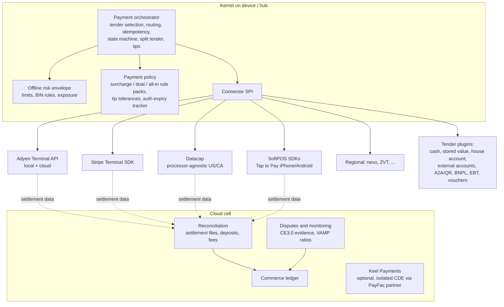

# Keel — Payments Architecture

> Status: **Draft v1** · Owner: Payments & Architecture · Last updated: 2026-09-27
>
> Decision record: [ADR-0005](../adr/0005-processor-agnostic-payments.md) · Evidence: [R03](../research/03-payments-compliance.md)

## 1. Goals

1. **Processor-agnostic by design.** Merchants choose their processor, can use several, and switch
   with a configuration change. No penalty fees and no hardware swaps where terminals can be
   re-boarded. (The industry norm is the opposite: mandatory processing, a reported ~$400/month or
   0.6–2% penalties for going outside, and processor-locked hardware
   ([R03 §1](../research/03-payments-compliance.md)).)
2. **Keel never touches card data.** Semi-integrated terminals and certified SoftPOS keep PANs out of
   every Keel component.
3. **Card authorization never transits Keel Cloud.** The path is device → terminal → processor.
4. **Every tender is a plugin**, from cards and cash to Pix, UPI, M-Pesa, EBT, meal vouchers, room
   charges, BNPL and partner-settled crypto, all on one state machine.
5. **Offline is explicit, bounded and observable.**
6. **Honest economics.** Cost of acceptance is visible per transaction. Surcharging is compliant by
   construction. Reconciliation is automatic.

## 2. Components



## 3. The connector SPI

Every processor or terminal family implements one Rust trait, plus a native bridge where the provider
ships only an iOS or Android SDK:

```rust
trait PaymentConnector {
    fn capabilities(&self) -> Capabilities;   // see table below
    fn pair_terminal(&self, cfg: TerminalConfig) -> Result<TerminalRef>;
    fn sale(&self, req: SaleRequest) -> PaymentOutcome;          // auth + capture
    fn authorize(&self, req: AuthRequest) -> PaymentOutcome;     // pre-auth / tabs
    fn increment(&self, id: &ProcessorRef, amount: Money) -> PaymentOutcome;
    fn adjust_tip(&self, id: &ProcessorRef, tip: Money) -> PaymentOutcome;
    fn capture(&self, id: &ProcessorRef, amount: Money) -> PaymentOutcome;
    fn void(&self, id: &ProcessorRef) -> PaymentOutcome;
    fn refund(&self, req: RefundRequest) -> PaymentOutcome;      // referenced / unreferenced
    fn status(&self, key: &IdempotencyKey) -> PaymentOutcome;    // resolve "unknown"
    fn offline_queue(&self) -> Vec<StoredOfflinePayment>;        // where the terminal stores
    fn settlement_source(&self) -> SettlementSource;             // for reconciliation
}
```

`PaymentOutcome` is one of `Approved{..}`, `PartiallyApproved{..}`, `Declined{..}`,
`Pending{confirm_by}` (async rails), `StoredOffline{..}`, or `Unknown{retry_after}`. **An `Unknown`
outcome blocks any new attempt on the same check until it is resolved via `status()`.** This is the
single most important rule for never double-charging.

| Capability flag | Meaning |
|---|---|
| `local_mode` | The terminal is reachable on the LAN; works without the internet up to the processor |
| `offline_store_forward` | Terminal or SDK can store and forward, with provider limits |
| `tip_adjust`, `on_terminal_tip` | Post-auth tip adjust; tip prompt on the device |
| `incremental_auth`, `extended_auth` | Tabs, hotels, rentals (with provider limits, e.g. max increments) |
| `partial_auth` | Supports partial approvals; the partial indicator is only sent from lanes that can split tender |
| `unreferenced_refund` | Refund without the original payment reference |
| `softpos` | Tap on phone (PCI MPoC-validated SDK) |
| `apps_on_device` | Keel can run on the provider's Android terminal |
| `network_tokens`, `card_on_file` | Stored credentials for tabs, memberships, no-show fees |
| `debit_routing` | US Common Debit AID and routing preferences |
| `ebt`, `fsa_iias` | Benefit and healthcare tenders |

## 4. Integration patterns

| Pattern | Use | PCI effect for merchant and Keel |
|---|---|---|
| **Semi-integrated terminal** (default) | Counters, bars, retail lanes | Keel is outside cardholder-data scope. Merchants on validated P2PE solutions qualify for SAQ P2PE. |
| **SoftPOS** (Tap to Pay on iPhone/Android via acquirer SDKs) | Handhelds, pop-ups, line busting, backup path | Sealed MPoC SDK. A device-eligibility registry covers OS version, NFC range certification and attestation. |
| **Keel on Android payment terminals** | Pay-at-table, handheld all-in-one | Keel runs beside the provider's payment app and never receives card data |
| **Hosted payment fields** (web, QR, kiosk-web) | Online ordering, QR pay | PSP iframes. Payment pages meet PCI DSS 6.4.3 and 11.6.1 (script inventory, SRI, CSP, tamper monitoring). |
| Fully integrated (Keel drives the card reader) | **Never** | Would pull Keel into full PCI scope |

**Launch connector shortlist** (criteria: local/offline capability, tabs and tips support, SoftPOS,
multi-country reach, data portability, ISV-friendliness):
1. **Adyen Terminal API**, local and cloud modes. It uses the nexo protocol, has broad global
   coverage, and offline EMV works in local mode.
2. **Stripe Terminal**: incremental and extended auth, overcapture, on-receipt tipping, Tap to Pay,
   strong developer tooling.
3. **Datacap**: processor-agnostic semi-integration across many US and Canadian processors, with EBT
   and FSA support. This is what makes "keep your processor" real for US merchants on day one.

Next, per market: nexo-based acquirers (EU), **ZVT** (the DACH terminal standard), regional leaders
(Moneris, Tyro/Windcave, Stone/Cielo/PagBank, Pine Labs/Razorpay), and more US processors via
Datacap-class gateways.

## 5. Tenders

All tenders share the payment state machine in the [domain model §7](./domain-model.md#7-payments),
including `Pending` for asynchronous rails.

| Family | Examples | Notes |
|---|---|---|
| Card-present | EMV contact/contactless, wallets | Via connectors. FACTA-truncated receipts with EMV data. |
| Cash | Local and foreign cash | Cash rounding on the cash tender only, as a separate audit line |
| Stored value | Keel gift cards, store credit, eWallet | Locked during a transaction. Activated only after the paying tender captures. Offline escrow. |
| House accounts | B2B receivables | Credit limits, PO or job numbers, statements |
| External accounts | Hotel PMS room charge, campus cards, third-party vouchers | `lookup → authorize → post → confirm \| void`, with an offline queue |
| Account-to-account and QR | Pix (incl. NFC), UPI, PayNow, PromptPay, DuitNow, QRIS, Alipay+/WeChat Pay, Wero, SEPA/UK pay-by-bank, FedNow/RTP request-to-pay | Dynamic QR or request-to-pay → `Pending` → webhook, poll or manual confirmation. Survives network loss after the QR is shown without double charging. |
| Mobile money | M-Pesa (STK push) | Push to phone → callback |
| BNPL and financing | Klarna, Affirm, Afterpay, Synchrony-class | As a tender or via wallet virtual cards |
| Benefits | EBT/SNAP, eWIC, FSA/HSA (IIAS), meal vouchers | **Line-eligibility engine** by jurisdiction and date. SNAP-first split. No tax on the SNAP portion. No surcharges. |
| Crypto and stablecoin | Via partners only | Partner-settled to fiat. Keel never takes custody. |

## 6. Card-present operations

- **Tips.** Tip on the device before authorization, or a tip adjust before capture. The **tolerance
  engine** checks `tip / authorized > tolerance(MCC, brand, card-present)`, e.g. Visa's 20% for
  restaurants (5812) and bars (5813). When the check fails, it triggers an **incremental
  authorization**. If that is declined, it flags the chargeback risk.
- **Tabs and holds.**
  - Pre-auth, then incremental auth as the tab grows past a configurable share of the authorized
    amount, within provider limits (e.g. a maximum number of increments).
  - The **auth-expiry tracker** re-authorizes or captures before validity windows lapse (tabs, hotels,
    multi-week rentals). Where re-authorization isn't possible, it falls back to a card-on-file
    merchant-initiated charge.
  - Walkouts auto-close at business-day end with the disclosed policy.
- **Partial authorization and N-way split tender.** The remaining balance carries forward across any
  mix of tenders.
- **Refunds.** *Referenced* refunds go to the original token across locations and channels, without
  the card. *Unreferenced* refunds are only allowed by policy (limits, manager approval, velocity
  checks). Refunds to store credit or a gift card are also available. Card-present refunds are used
  where a market requires them.
- **Receipts.** FACTA truncation (US), required EMV data, surcharge and fee lines, tip lines, fiscal
  payloads and localized legends, all rendered by KeelDoc.

## 7. Offline payments

Incumbent limits vary widely, and in all cases the merchant bears declines
([R03 §2.5](../research/03-payments-compliance.md), [R01](../research/01-restaurant-pos.md)):

| Vendor | Offline limits | Who bears the decline risk |
|---|---|---|
| Square | $1–$50k per transaction, expires after 72 h | Merchant |
| Toast | Authorization may expire in 24 h | Merchant ("decline is final") |
| Clover | 7 days, per-transaction and total caps | Merchant |
| Stripe Terminal | $10k offline total, plus account limits | Merchant |
| Adyen | Local mode only, configurable | Merchant |

**Keel's risk envelope:**
- **Consent.** The merchant opts in explicitly and acknowledges liability, per location.
- **Limits.** Per transaction, per card fingerprint, per device and per location in total, all capped
  at the connector's own limits. Also a maximum age, with alerts before the provider's expiry (e.g. at
  1 h, 12 h and 48 h for a 72 h window).
- **Adaptive rules.**
  - Refuse by card type or issuer country (BIN), e.g. no prepaid or foreign cards offline.
  - Allow only chip or contactless with offline data authentication where supported.
  - Lower limits late in the business day, when recovery is harder.
- **Evidence for recovery.** Optional guest phone or email capture, plus itemized receipts and EMV
  data kept for chargeback defense.
- **Visibility.** A live **exposure meter** on every device and on the manager dashboard.
- **Forwarding.** Automatic within 60 s of connectivity returning; 99.9% forwarded within 5 minutes.
- **Offline-declined recovery workflow**: see [offline-and-sync §10](./offline-and-sync.md#10-side-effects-the-outbox-and-effect-ownership).
- **Fiscal interplay.** A fiscal receipt can be issued while settlement is pending, where local law
  allows.

## 8. Routing, failover and portability

- **Routing policy** by location, revenue center, channel, card brand, BIN and amount, e.g. "AmEx
  through connector B" or "online through connector C".
- **Failover modes** when the primary processor is degraded (detected by circuit breaker, see
  [offline-and-sync §6.6](./offline-and-sync.md)):
  1. A dual-acquirer gateway (Datacap-class) routes to a secondary processor.
  2. A backup terminal or SoftPOS on a secondary connector.
  3. Offline store-and-forward within the risk envelope.
  4. Other tenders.

  Card-present terminals are key-injected per acquirer path, so failover is designed per site rather
  than assumed.
- **US debit routing**: Common Debit AID support, merchant routing preferences, and a report of the
  realized savings from least-cost routing.
- **Card-on-file portability**: stored credentials are **network tokens** or held in a **PCI Level 1
  vault** that can route to more than one acquirer. Keel guarantees a PCI-compliant export of stored
  cards to a named recipient on request, completed within 10 business days.

## 9. Surcharging, dual pricing and all-in pricing

Implemented as **rule packs** (see [compliance.md](./compliance.md)), not a percentage field.

- **Inputs**:
  - jurisdiction and effective date;
  - card network and product (credit vs debit/prepaid, from BIN data; debit is never surcharged, even
    when run as credit);
  - MCC and channel;
  - the merchant's actual trailing cost of acceptance;
  - brand-level vs product-level mode.
- **Rules encoded today** (verify before launch; see
  [R03 Appendix A](../research/03-payments-compliance.md)):
  - network caps: Visa 3%, Mastercard 4%;
  - state bans: CT, MA, ME, PR;
  - Colorado cap: 2%;
  - New York display rules;
  - California SB 478 all-in pricing, with the SB 1524 restaurant disclosure variant;
  - EU/UK consumer-card surcharge bans;
  - Canadian caps, with the Québec ban;
  - Australian rules pending the RBA decision.
- **Outputs**: allowed or denied; the amount; disclosures for menus, signage, receipts and online; a
  receipt line; a 30-day acquirer-notice checklist.
- **Dual-pricing mode**: both prices on every item, menu, online listing and shelf-label export. A
  display linter blocks publishing incomplete dual prices.
- **Settlement-ready controls**: acceptance of card categories (e.g. declining premium or commercial
  credit) is built behind a flag pending the US interchange settlement's final approval and scheme
  rule updates.
- **Golden tests**: 200+ cases, including debit-as-credit and ban-state locations.

## 10. Reconciliation, fees, disputes and the ledger

- **Cost of acceptance per transaction**: interchange, scheme fees and markup (IC++) are stored on
  every payment when the connector provides them. **Fee audit** compares actual fees with the
  contracted pricing and flags drift.
- **Settlement ingestion**: provider APIs, files and webhooks → matched to payments → deposits matched
  to bank lines.
  - Every deposit breaks down into sales, refunds, chargebacks, fees, tips and adjustments.
  - Target: a single-location day close in ≤ 5 minutes.
  - Everything posts to the commerce ledger ([domain model §16](./domain-model.md#16-the-commerce-ledger)).
- **Disputes**:
  - Evidence captured at sale time for **Visa CE3.0** and **Mastercard First-Party Trust**: device,
    customer ID, order history, delivery proof, EMV data and signed receipts.
  - Auto-assembled dispute packets with deadlines.
  - **VAMP-style monitoring** of fraud and dispute ratios per merchant, alerting at 70% of scheme
    thresholds (Visa's merchant threshold tightened to 1.5% in April 2026).
- **Online fraud**: velocity limits and card-testing defenses on online ordering and gift card
  purchase.

## 11. Keel Payments (optional, v2)

- Delivered through a **PayFac-as-a-service partner**. Keel operates a **separately isolated
  cardholder-data environment** (separate accounts, HSM-backed keys, dedicated CI/CD, six-monthly
  segmentation tests) only if the partner model requires it. The POS product stays out of scope.
- **Published interchange-plus pricing** with the markup shown. The same software price with or
  without Keel Payments, and no incentive tied to contract length.
- **Payouts**: next-day by default. Instant payouts show the fee in dollars before each transfer.
- **Explainable holds**: every reserve or hold shows its reason code, amount and release date, with an
  in-app appeal and a human risk analyst response within 1 business day. New rolling reserves get 7
  days' notice except for suspected fraud.
- **Capital offers (v3, via licensed partners)**: total repayment in dollars, holdback %, and an
  APR-equivalent. Never pre-checked, never tied to processing terms, and compliant with state
  commercial-financing disclosure laws.

## 12. Verification

- **Connector contract suite**: sale, tip adjust, incremental auth, partial auth, split tender, void,
  referenced and unreferenced refund, offline store-and-forward, and unknown-outcome resolution. It
  runs against every connector's sandbox or simulator, plus certified hardware in the lab.
- **Deterministic simulation**: payment effects with timeouts and unknown outcomes under partitions.
  The invariant is at most one successful charge per idempotency key.
- **Scheme rule matrices** (tips, tolerances, surcharges) as golden tables.
- **Certification**: per acquirer, per terminal family and per SoftPOS SDK, tracked in a certification
  matrix with version pins.
