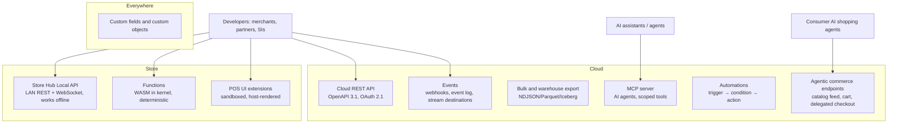

# Keel — Platform, APIs and Extensibility

> Status: **Draft v1** · Owner: Architecture · Last updated: 2026-09-27
>
> Decision record: [ADR-0008](../adr/0008-wasm-extensions-run-offline.md)

## 1. Principles

1. **API parity.** Keel's own apps are built on the same public APIs that merchants and partners use.
   If the back office can do it, the API can do it. There are no private "partner-only" capabilities
   for data a merchant owns.
2. **The merchant owns their data.** Merchants and their chosen developers get full API and export
   access to their own data **for free**, without joining a partner program. Marketplace listing is
   optional, and only needed to distribute to *other* merchants.
3. **Extensions work offline.** Business logic extensions run inside the kernel on the device, so
   custom pricing, validation and routing behave the same with or without internet. No incumbent
   offers this.
4. **Safe by construction.** Every extension is sandboxed, permission-scoped, resource-limited,
   signed, versioned, staged and revocable with a kill switch.
5. **Stable contracts.** APIs are date-versioned, with at least 12 months of deprecation notice,
   machine-readable changelogs and contract tests.

## 2. Surface map

## 3. Cloud REST API

- **Style**: resource-oriented JSON over HTTPS. The OpenAPI 3.1 spec is generated from the same schema
   source as kernel types, so the API, SDKs and kernel can never drift.
- **Authentication**:
  - OAuth 2.1: authorization code + PKCE for apps; client credentials for a merchant's private
    integrations.
  - Short-lived access tokens, with refresh-token rotation.
  - **Fine-grained scopes** per resource and action, optionally restricted to specific locations
    (e.g. `orders:read@location/…`).
- **Writes**:
  - Every mutating request accepts an `Idempotency-Key`, and replays return the original result.
  - Writes go through the same kernel command path (authorize → validate → extensions → events)
    as device commands.
- **Reads**:
  - Cursor pagination, filtering, sorting, field selection (`fields=`) and expansion
    (`expand=customer,payments`).
  - Consistent `updated_since` semantics for incremental sync by integrators.
- **Versioning**: the `Keel-Version: 2026-10-01` header pins behavior. Each account has a default
  version, and upgrades are explicit and testable in the sandbox.
- **Errors**: stable machine codes, a human message, a `doc_url` and a request ID. Validation errors
  point to the exact field.
- **Rate limits**: per app × per merchant token buckets, with standard `RateLimit` headers. Bulk jobs
  exist so integrators never need to hammer list endpoints.
- **Bulk operations**: async jobs for imports and exports (catalog of 1M SKUs, historical orders),
  with progress and a result file.
- **Resource families**:
  - locations and devices;
  - catalog, menus, price lists and availability;
  - orders, checks and payments;
  - fulfillments;
  - inventory (levels, movements, POs, transfers, counts);
  - customers, stored value, loyalty, memberships and house accounts;
  - bookings and resources;
  - team, roles, time entries, schedules and tips;
  - cash sessions;
  - fiscal documents;
  - ledger and journal exports;
  - reports (semantic-layer queries);
  - webhooks and apps;
  - custom data.

## 4. Events

- **Webhooks**:
  - At-least-once delivery.
  - Signed per the **Standard Webhooks** specification (HMAC-SHA256 with a timestamp and message ID)
    to prevent replay.
  - Retried with exponential backoff for up to 72 h.
  - Per-endpoint event-type filters.
  - **Ordering key** per aggregate, so consumers can process one order's events in order.
- **Payloads**: an event envelope plus a full snapshot of the resource at that version ("fat"
  events), so consumers don't need a follow-up GET that races with later changes.
- **Event log API**: `GET /events?after=cursor` returns the durable, filterable event history
  (90 days hot, older on request). Any integrator can recover from downtime without special support.
- **Replay**: re-send any event or range to an endpoint from the dashboard or API.
- **Stream destinations** (for enterprises): AWS EventBridge, Google Pub/Sub, Azure Event Grid and
  Kafka, with the same envelopes.
- **Delivery observability**: a per-endpoint success rate, latency and last errors, visible to the
  developer and the merchant.

## 5. Store Hub Local API

The Store Hub exposes a **LAN API** (REST + WebSocket, mTLS or device-scoped tokens) with the same
resource shapes as the cloud API for the in-store subset. It is available with no internet at all.

Use cases no cloud-only POS can serve reliably:
- digital menu boards and order-status screens that react instantly to 86s and ready orders;
- drive-thru timers and loop detectors;
- kitchen automation (fryer or robot integrations);
- electronic shelf labels;
- CCTV and video analytics overlaying transactions on footage for loss prevention;
- cash recyclers;
- legacy in-store systems (ERP terminals, fuel controllers);
- venue access control.

The local API supports **subscriptions**: a WebSocket stream of in-store events, filtered by type,
revenue center or station.

## 6. Functions — logic extensions (WASM, offline, deterministic)

Functions let developers change *how Keel decides* without changing Keel.

- **Runtime**: WebAssembly modules executed inside the kernel's sandbox. Keel uses an interpreter
  (`wasmi`) on platforms that forbid JIT (iOS), and `wasmtime` elsewhere.
- **Determinism and limits**:
  - Pure functions: CBOR/JSON input → output, with published schemas.
  - No clock, randomness, network or filesystem. The kernel provides everything as input.
  - Fuel metering (an instruction budget, e.g. 5 ms equivalent), a memory cap (e.g. 16 MB) and a
    module size cap.
  - The **same inputs always produce the same outputs on every device, the hub and the cloud**,
    which is required for totals to converge.
- **Hook points** (initial set):

| Hook | Purpose | Example |
|---|---|---|
| `pricing.promotions` | Contribute custom promotion candidates | "Buy any 3 craft beers from brewery X, get the cheapest at 50%" |
| `pricing.line_price` | Custom unit-price logic | Contract pricing formula for B2B customers |
| `order.validate` | Warn or block on command | "Can't sell alcohol before 10:00 on Sundays in this county" |
| `checkout.tenders` | Filter or reorder allowed tenders | "House accounts only for tagged contractors" |
| `kitchen.routing` | Custom station routing | Route to a pizza oven station based on dough type |
| `fulfillment.routing` | Pick the fulfilling location | Ship from the store with the most stock within 50 km |
| `loyalty.earn` | Custom earn rules | Double points on the customer's birthday week |
| `returns.policy` | Custom return eligibility | Holiday extended return window |
| `receipt.extra` | Add receipt blocks | Custom survey code, warranty info |
| `tax.adjust` (restricted) | Jurisdiction-specific tax edge cases | Requires Keel review and signed approval |

- **Lifecycle**:
  - Modules are signed by the developer and scanned and reviewed by Keel (for marketplace apps).
  - The merchant installs and configures them.
  - Rollout is staged per location.
  - Health is monitored (errors, fuel exhaustion).
  - **Fail-safe policy** per hook: on error, *skip* (e.g. a promotion) or *block with manager
    override* (e.g. a compliance validation). The choice is declared by the developer and visible to
    the merchant.
- **Languages**: anything that compiles to WASM: Rust, TinyGo, AssemblyScript, C/C++, and JS/TS via
  a QuickJS-in-WASM toolchain. SDKs ship with typed input/output bindings and a local test harness
  with golden cases.

## 7. POS UI extensions

- **Model**: extension code runs in a **sandboxed JS runtime inside the kernel** (QuickJS-class, no
  DOM, no native access, memory and CPU limits). It describes UI with Keel's **remote component set**:
  Tile, Button, Text, List, Form fields, Banner, Sheet, Modal, Scanner prompt and Signature. The native
  host (Compose or SwiftUI) renders native components from the same schema on every platform.
  Extension bundles are cached on the device and **run offline**. Extensions therefore:
  - look native and respect accessibility, theming and localization automatically;
  - can't read the screen, keystrokes or other extensions' data;
  - and can't degrade frame rate (render budgets are enforced).
- **Targets**: home-screen tiles, cart or line actions, order actions, customer profile panels,
  pre-payment and post-payment screens, return and exchange actions, receipt blocks, KDS item
  annotations, and back-office pages and blocks.
- **Validation interceptors**: extensions can register cart or payment validation (warn or block,
  with declared offline behavior), following the pattern proven by Shopify's POS UI extensions
  ([R04 §7.6](../research/04-technical-architecture.md)).
- **Data access**: scoped Keel APIs (the local kernel query API offline; the cloud API online) and an
  allow-listed `fetch` to the developer's own backend (online only; declared offline behavior).
- **Examples**: warranty upsell at checkout; a custom loyalty provider's lookup panel; a "send to
  tailor" action for alterations; a winery's allocation-club panel.

## 8. Automations (no-code)

- **Trigger → conditions → actions** builder with templates. Examples:
  - low stock → draft a purchase order for the preferred vendor;
  - void over $50 → notify the GM with a video-clip link;
  - customer's 5th visit → tag them "regular" and send a thank-you;
  - failed membership charge → dunning sequence;
  - online order late by 10 min → text the customer an apology code.
- **Execution**: most automations run in the cloud. *Local automations* (in-store triggers and
  actions such as "flash the pickup-shelf light when an order is ready") run on the hub and work
  offline.
- Every run is logged and replayable. Actions are idempotent, and loops are detected.
- **Connectors**: native actions for common SaaS, plus Zapier, Make and n8n apps for the long tail.

## 9. Custom data

- **Custom fields** (typed: text, number, money, date, reference, list, JSON with schema) on every
  resource, with validation, localization, visibility rules and indexing for search and filters.
- **Custom objects** for merchant-defined entities (e.g. "wine club allocation", "equipment
  inspection"), with relations to core resources.
- Custom data is available in the API, UI extensions, Functions, reports, receipts, automations,
  exports and the AI copilot.

## 10. Data portability — "Leave anytime, take everything"

- **Self-serve full export**:
  - every entity and the complete event history, in a documented open schema;
  - formats: NDJSON, CSV and Parquet;
  - receipt and fiscal archives in their legal formats.

  There is no fee, no support ticket and no waiting period.
- **Continuous warehouse sync**: Snowflake, BigQuery, Databricks, Redshift, or plain S3/GCS/Azure
  storage as Apache Iceberg tables, updated within minutes.
- **Migration tooling in and out**: importers for competitor exports (menus, catalogs, customers,
  gift card balances, history), and published exporters to common formats. We compete on product,
  not captivity.
- This posture also meets the **EU Data Act's** switching and portability obligations by design (in
  application since September 2025, with switching charges to be phased out by January 2027).

## 11. AI surfaces for developers

- **Keel MCP server** (remote, OAuth-scoped, **read-only by default**; write scopes must be granted
  explicitly, as with the read-only switches other commerce MCP servers offer):
  - Exposes merchant-scoped tools: query sales through the semantic layer, look up catalog and
    inventory, draft purchase orders and schedules, manage availability and search customers.
  - Every write goes through the same permission system as staff actions.
  - Consequential writes require human confirmation (MCP elicitation) or a pre-approved policy.
  - Full audit trail.
- **Agentic commerce endpoints**:
  - A machine-readable catalog with real-time availability and pricing, plus cart and checkout
    endpoints that accept **delegated payment credentials** from consumer AI agents.
  - Adapters for the emerging open protocols: Google/Shopify **UCP** (with signed
    `/.well-known/ucp` merchant profiles), OpenAI/Stripe **ACP**, and **AP2** mandates.
  - **Agent verification**: Visa Trusted Agent Protocol and Web Bot Auth signatures.
  - These protocols are still in flux (as of September 2026 one early agent-checkout product had
    reportedly been wound down), so adapters sit behind one internal agent-channel interface
    ([R04 §9.2](../research/04-technical-architecture.md)).
  - Agent orders are a POS **channel** for pickup, delivery or reservations. The protocols don't cover
    card-present checkout. The POS event stream drives agent-facing availability, 86s, prep times and
    slots in real time.
  - Merchant controls: which channels agents may use, price parity rules, order limits and rate
    limits. Agent orders are labeled on the KDS and in reports.

## 12. Developer experience

- **Sandbox accounts** with simulated locations, a simulated hub, simulated payment terminals (test
  cards including declines, offline, partial approvals and timeouts), simulated delivery partners and
  fiscal authorities.
- **`keel` CLI**:
  - scaffold apps, Functions and UI extensions;
  - run Functions against golden tests;
  - hot-reload UI extensions onto a real device;
  - tail events;
  - replay a recorded order through your Function.
- **SDKs** generated from OpenAPI: TypeScript, Python, Go, Java/Kotlin, C#, Swift, PHP and Ruby. Each
  follows its language's idioms, with idempotency and pagination helpers built in.
- **Docs** with runnable examples, per-endpoint changelogs, deprecation dashboards, and a status page
  per API and per region.

## 13. App marketplace

- **Listings** with transparent permissions ("this app can read orders and customer emails").
  Merchant reviews and verified install counts.
- **Review process**: automated security, privacy and performance checks, plus a human review for
  sensitive scopes. A "Built for Keel" tier requires meeting UX and reliability bars.
- **Billing**: optional Keel-managed app billing. Developer-friendly economics: no revenue share on a
  developer's first $1M in annual marketplace revenue, and a low flat rate after that. There are no
  fees for API access to a merchant's own data.
- **Uninstall is clean**: tokens are revoked, Functions and UI extensions removed, and data deletion
  hooks called and verified.
